<!-- ═══════════════════════════════════════════════════════════ -->
<!--                        HERO BANNER                        -->
<!-- ═══════════════════════════════════════════════════════════ -->

 

 

  

> **A comprehensive DevOps practice project** demonstrating the full lifecycle of building, securing, deploying, and operating a cloud-native application on **AWS EKS** — from infrastructure provisioning with Terraform, through multi-stage CI/CD pipelines, to GitOps-driven Kubernetes deployments with observability, logging, and intelligent automation.

 

<!-- ═══════════════════════════════════════════════════════════ -->
<!--                    TABLE OF CONTENTS                       -->
<!-- ═══════════════════════════════════════════════════════════ -->

## 📑 Table of Contents

<table>
<tr>
<td width="50%">

- [🏗️ Architecture Overview](#%EF%B8%8F-architecture-overview)
- [📦 Repository Map](#-repository-map)
- [☁️ Infrastructure Layer — Terraform](#%EF%B8%8F-infrastructure-layer--terraform)
- [🔄 CI/CD Pipelines — Jenkins](#-cicd-pipelines--jenkins)
- [🚀 GitOps & Deployment — Argo CD](#-gitops--deployment--argo-cd)

</td>
<td width="50%">

- [📊 Observability Stack](#-observability-stack)
- [📝 Centralized Logging — EFK](#-centralized-logging--efk)
- [🤖 Intelligent Automation — n8n](#-intelligent-automation--n8n)
- [🔐 Security Practices](#-security-practices)
- [👥 Team & Purpose](#-team--purpose)

</td>
</tr>
</table>

---

<!-- ═══════════════════════════════════════════════════════════ -->
<!--                  ARCHITECTURE OVERVIEW                     -->
<!-- ═══════════════════════════════════════════════════════════ -->

## 🏗️ Architecture Overview

```mermaid
%%{init: {'theme': 'dark', 'themeVariables': {'fontFamily': 'monospace'}}}%%
flowchart TB
    subgraph DEV["🧑‍💻 Developer Workflow"]
        direction LR
        CODE[Push Code] --> GH[GitHub]
    end

    subgraph INFRA["☁️ AWS Infrastructure · Terraform"]
        direction TB
        VPC["🌐 VPC · Subnets · SGs"]
        EKS["⎈ EKS Cluster"]
        RDS["🗄️ RDS PostgreSQL"]
        ECR["📦 ECR Registry"]
        SM["🔑 Secrets Manager"]
        IAM["👤 IAM · IRSA"]
        VPC --> EKS
        VPC --> RDS
        IAM --> EKS
    end

    subgraph CI["🔄 Jenkins CI/CD"]
        direction TB
        TEST["✅ Unit Tests\n+ Coverage"]
        SONAR["🔍 SonarQube\nQuality Gate"]
        OWASP["🛡️ OWASP\nDep-Check"]
        KANIKO["🐳 Kaniko\nBuild"]
        TRIVY["🔒 Trivy\nImage Scan"]
        NEXUS["📚 Nexus\nArtifacts"]
        TEST --> SONAR --> OWASP --> KANIKO --> TRIVY
        KANIKO --> NEXUS
    end

    subgraph CD["🚀 GitOps · Argo CD"]
        direction TB
        ARGO["Argo CD\nApp-of-Apps"]
        SYNC["Auto Sync\n+ Self-Heal"]
        ARGO --> SYNC
    end

    subgraph K8S["⎈ Kubernetes Workloads"]
        direction TB
        FE["⚛️ Frontend\nReact · Nginx"]
        BE["🐍 Backend\nDjango · Gunicorn"]
        REDIS["⚡ Redis\nCache"]
        MC["💾 Memcached"]
        FE -->|"/api proxy"| BE
        BE --> REDIS
    end

    subgraph OBS["📊 Observability"]
        direction LR
        PROM["Prometheus"]
        GRAF["Grafana"]
        EFK_S["EFK Stack"]
        PROM --> GRAF
    end

    subgraph NOTIFY["🤖 Automation"]
        N8N["n8n Workflows\nSmart Alerts"]
    end

    GH -->|Webhook| CI
    TRIVY -->|Push Image| ECR
    CI -->|Notify| N8N
    GH -->|Sync| CD
    SYNC --> K8S
    K8S --> OBS
    BE -->|SSL| RDS
    K8S ---|Secrets via IRSA| SM
    EKS --- K8S

    style DEV fill:#0d1117,stroke:#58a6ff,stroke-width:2px,color:#c9d1d9
    style INFRA fill:#0d1117,stroke:#f0883e,stroke-width:2px,color:#c9d1d9
    style CI fill:#0d1117,stroke:#d24939,stroke-width:2px,color:#c9d1d9
    style CD fill:#0d1117,stroke:#ef7b4d,stroke-width:2px,color:#c9d1d9
    style K8S fill:#0d1117,stroke:#326ce5,stroke-width:2px,color:#c9d1d9
    style OBS fill:#0d1117,stroke:#e6a817,stroke-width:2px,color:#c9d1d9
    style NOTIFY fill:#0d1117,stroke:#ff6d5a,stroke-width:2px,color:#c9d1d9
```

---

<!-- ═══════════════════════════════════════════════════════════ -->
<!--                     REPOSITORY MAP                         -->
<!-- ═══════════════════════════════════════════════════════════ -->

## 📦 Repository Map

| Repository | Purpose | Key Technologies |
|:----------:|:--------|:----------------:|
| **[Terraform-Infra](https://github.com/NTI-Django-React-Project/Terraform-Infra)** | AWS infrastructure as code — EKS, RDS, VPC, IAM, ECR, Secrets Manager |   |
| **[App-Back-End](https://github.com/NTI-Django-React-Project/App-Back-End)** | Django REST backend with full Jenkins CI/CD pipeline |   |
| **[App-Front-End](https://github.com/NTI-Django-React-Project/App-Front-End)** | React frontend served via Nginx with Jenkins CI/CD |   |
| **[k8s-manifests](https://github.com/NTI-Django-React-Project/k8s-manifests)** | Kubernetes manifests — Argo CD apps, deployments, observability, logging |   |
| **[n8n](https://github.com/NTI-Django-React-Project/n8n)** | Workflow automation — smart CI/CD notifications via webhooks |  |

---

<!-- ═══════════════════════════════════════════════════════════ -->
<!--                  INFRASTRUCTURE LAYER                      -->
<!-- ═══════════════════════════════════════════════════════════ -->

## ☁️ Infrastructure Layer — Terraform

> **Fully modular IaC** provisioning all AWS resources needed to run a production Kubernetes platform.

### 🧱 Module Inventory

<table>
<tr><th>Category</th><th>Modules</th><th>What They Provision</th></tr>
<tr>
<td><b>🌐 Networking</b></td>
<td><code>security-group</code> · <code>security-group-rule</code></td>
<td>VPC security groups with fine-grained ingress/egress rules</td>
</tr>
<tr>
<td><b>⎈ Kubernetes</b></td>
<td><code>eks</code> · <code>eks-network</code> · <code>eks-namespace</code> · <code>eks-irsa</code></td>
<td>EKS cluster, networking add-ons, namespace isolation, IAM Roles for Service Accounts</td>
</tr>
<tr>
<td><b>👤 Identity</b></td>
<td><code>iam-role</code> · <code>iam-policy</code> · <code>iam-group</code> · <code>iam-user</code> · <code>iam-role-policy-attachment</code> · <code>iam-group-policy-attachment</code> · <code>iam-user-group-membership</code></td>
<td>Complete IAM hierarchy — roles, policies, groups, users, and least-privilege bindings</td>
</tr>
<tr>
<td><b>🗄️ Data</b></td>
<td><code>rds</code> · <code>ecr</code> · <code>secret-manager</code></td>
<td>PostgreSQL RDS instance, ECR container repos, and AWS Secrets Manager entries</td>
</tr>
<tr>
<td><b>🖥️ Compute</b></td>
<td><code>ec2</code></td>
<td>Stand-alone Jenkins server on EC2</td>
</tr>
</table>

### 📐 Infrastructure Stacks

| Stack | Description |
|-------|-------------|
| **`eks infra/`** | The main production stack — provisions VPC, subnets, EKS cluster with managed node groups, RDS PostgreSQL, ECR repositories, Secrets Manager, IAM roles/IRSA, and all networking |
| **`stand-alone-jenkins-server/`** | Dedicated EC2 instance pre-configured as a Jenkins CI server with Docker, AWS CLI, and security tooling |
| **`terraform-backend/`** | S3 bucket + DynamoDB table for remote state management and state locking |

---

<!-- ═══════════════════════════════════════════════════════════ -->
<!--                     CI/CD PIPELINES                        -->
<!-- ═══════════════════════════════════════════════════════════ -->

## 🔄 CI/CD Pipelines — Jenkins

> **Declarative, security-first pipelines** that test, scan, build, and push container images — with zero-trust Docker builds via **Kaniko**.

```mermaid
%%{init: {'theme': 'dark'}}%%
flowchart LR
    subgraph BACKEND_PIPE["🐍 Backend Pipeline — 14 Stages"]
        direction LR
        B1["📥 Checkout"] --> B2["🗄️ Start Test DB"] --> B3["🐍 Setup Python"] --> B4["🔌 Validate DB"] --> B5["📋 Migrations"] --> B6["🏗️ Build Django"] --> B7["✅ Tests + Coverage"]
        B7 --> B8["🔍 SonarQube"] --> B9["🚦 Quality Gate"] --> B10["🛡️ OWASP"] --> B11["📚 Nexus Upload"] --> B12["🐳 Kaniko Build"] --> B13["🔒 Trivy Scan"] --> B14["📤 Push to ECR"]
    end

    style BACKEND_PIPE fill:#0d1117,stroke:#d24939,stroke-width:2px,color:#c9d1d9
```

```mermaid
%%{init: {'theme': 'dark'}}%%
flowchart LR
    subgraph FRONTEND_PIPE["⚛️ Frontend Pipeline — 10 Stages"]
        direction LR
        F1["📥 Checkout"] --> F2["📦 npm install"] --> F3["🏗️ npm run build"] --> F4["🔍 SonarQube"] --> F5["🚦 Quality Gate"]
        F5 --> F6["🛡️ OWASP"] --> F7["📚 Nexus Upload"] --> F8["🐳 Kaniko Build"] --> F9["🔒 Trivy Image"] --> F10["🔍 Trivy FS"]
    end

    style FRONTEND_PIPE fill:#0d1117,stroke:#61dafb,stroke-width:2px,color:#c9d1d9
```

### 🔑 Pipeline Highlights

<table>
<tr>
<td width="50%">

**🐍 Backend Pipeline**
- Real PostgreSQL 15 container spun up for integration tests
- `pytest` with coverage reports (HTML, XML, terminal)
- Multi-stage Docker build → **non-root** `appuser`
- Images pushed to **AWS ECR** (`eu-north-1`)
- Tags: `{BUILD_NUMBER}-{SHORT_COMMIT}` + `latest`

</td>
<td width="50%">

**⚛️ Frontend Pipeline**
- React production build via Node.js 18
- Multi-stage Docker: `node:20-alpine` → `nginx:alpine`
- Nginx reverse-proxy config for `/api` → backend
- Build artifacts archived to **Nexus Raw** repository
- Images pushed to **Docker Hub**

</td>
</tr>
</table>

### 🛡️ Security Gates (Both Pipelines)

| Gate | Tool | Purpose |
|------|------|---------|
| **Code Quality** | SonarQube + Quality Gate | Static analysis, code smells, coverage enforcement — pipeline **aborts** on failure |
| **Dependency Scan** | OWASP Dependency-Check + NVD | CVE scanning for all project dependencies |
| **Image Scan** | Trivy | HIGH/CRITICAL vulnerability scanning on final container images |
| **Rootless Builds** | Kaniko | In-cluster, daemon-less Docker builds — no privileged containers needed |

---

<!-- ═══════════════════════════════════════════════════════════ -->
<!--                    GITOPS & DEPLOYMENT                     -->
<!-- ═══════════════════════════════════════════════════════════ -->

## 🚀 GitOps & Deployment — Argo CD

> **App-of-Apps pattern** with **sync waves** for ordered, self-healing deployments.

Argo CD watches the `k8s-manifests` repository and automatically reconciles the cluster state. Every component is declared as an Argo CD `Application` resource, organized by sync waves to respect dependency ordering.

### ⎈ Kubernetes Resources Deployed

<table>
<tr>
<td width="50%">

**Backend Namespace**
- `Deployment` — 2 replicas, Gunicorn workers
- `Service` — ClusterIP on port 8000
- `Ingress` — ALB with SSL termination (`/api`)
- `ConfigMap` — RDS host, DB name, Redis URL
- `SecretStore` — AWS Secrets Manager via IRSA
- `ExternalSecret` — Auto-syncs RDS password
- `Redis` — In-cluster cache (Deployment + Service)
- `Job` — Database migration runner

</td>
<td width="50%">

**Frontend Namespace**
- `Deployment` — 2 replicas, Nginx serving React build
- `Service` — ClusterIP on port 80
- `Ingress` — ALB with SSL termination (`/`)

**Shared Infrastructure**
- `AWS ALB Controller` — Kubernetes Ingress → AWS ALB
- `External Secrets Operator` — K8s ↔ AWS Secrets Manager
- Shared ALB group (`shared-alb`) for cost optimization
- SSL via ACM certificate

</td>
</tr>
</table>

### 🔐 Secrets Management Flow

```mermaid
%%{init: {'theme': 'dark'}}%%
flowchart LR
    A["AWS Secrets Manager\n🔑 RDS Password"] -->|IRSA Auth| B["External Secrets\nOperator"]
    B -->|Creates/Syncs| C["K8s Secret\nrds-db-secret"]
    C -->|Mounted as env| D["Backend Pod\n🐍 Django"]
    
    E["ConfigMap\nrds-config"] -->|"DB_HOST, DB_NAME\nDB_USER, REDIS_URL"| D

    style A fill:#f0883e,stroke:#333,color:white
    style B fill:#326ce5,stroke:#333,color:white
    style C fill:#238636,stroke:#333,color:white
    style D fill:#0d1117,stroke:#58a6ff,color:#c9d1d9
    style E fill:#0d1117,stroke:#58a6ff,color:#c9d1d9
```

---

<!-- ═══════════════════════════════════════════════════════════ -->
<!--                   OBSERVABILITY STACK                      -->
<!-- ═══════════════════════════════════════════════════════════ -->

## 📊 Observability Stack

> **Full-stack monitoring** with Prometheus metrics collection and Grafana visualization, deployed via Helm through Argo CD.

```mermaid
%%{init: {'theme': 'dark'}}%%
flowchart LR
    subgraph METRICS["📈 Metrics Collection"]
        NE["Node Exporter\nHost Metrics"]
        KSM["Kube State Metrics\nK8s Objects"]
        KUB["Kubelet\nPod Metrics"]
    end

    PROM["🔴 Prometheus\n1 Replica · 5Gi cap"]

    GRAF["📊 Grafana\nPersistent · 5Gi\n🌐 grafana.yassinabuelsheikh.store"]

    NE --> PROM
    KSM --> PROM
    KUB --> PROM
    PROM --> GRAF

    style METRICS fill:#0d1117,stroke:#e6a817,stroke-width:2px,color:#c9d1d9
    style PROM fill:#e6522c,stroke:#333,stroke-width:2px,color:white
    style GRAF fill:#f46800,stroke:#333,stroke-width:2px,color:white
```

| Component | Configuration |
|-----------|--------------|
| **Prometheus** | 1 replica, 3h retention, 200MB storage cap, resource-bounded (200m–2000m CPU, 1–5Gi RAM) |
| **Grafana** | Persistent storage (5Gi), admin creds from K8s Secret, exposed via ALB Ingress with SSL |
| **Kube State Metrics** | Enabled with resource limits, tracking all K8s object states |
| **Node Exporter** | DaemonSet on all nodes, lightweight host-level metrics |

---

<!-- ═══════════════════════════════════════════════════════════ -->
<!--                   CENTRALIZED LOGGING                      -->
<!-- ═══════════════════════════════════════════════════════════ -->

## 📝 Centralized Logging — EFK

> **Elasticsearch + Fluent Bit + Kibana** for aggregating, searching, and visualizing logs from all pods across the cluster.

```mermaid
%%{init: {'theme': 'dark'}}%%
flowchart LR
    PODS["🐳 All Pods\n/var/log/pods"] -->|Tail Logs| FB["📤 Fluent Bit\nDaemonSet\nv2.2.2"]
    FB -->|Index: fluent-bit| ES["🔍 Elasticsearch\nSingle-node\nv8.11.1"]
    ES --> KB["📊 Kibana\nDashboards\nv8.11.1"]

    style PODS fill:#0d1117,stroke:#58a6ff,color:#c9d1d9
    style FB fill:#49bda5,stroke:#333,color:white
    style ES fill:#fed10a,stroke:#333,color:black
    style KB fill:#e8478b,stroke:#333,color:white
```

| Component | Details |
|-----------|---------|
| **Fluent Bit** | DaemonSet tailing `/var/log/pods/*/*/*.log`, forwarding to Elasticsearch on port 9200 |
| **Elasticsearch** | Single-node deployment, 2Gi memory, security disabled for internal use, readiness probe on `/_cluster/health` |
| **Kibana** | Connected to Elasticsearch, readiness probe on `/api/status`, resource limits: 512Mi–1Gi RAM |

---

<!-- ═══════════════════════════════════════════════════════════ -->
<!--                     N8N AUTOMATION                         -->
<!-- ═══════════════════════════════════════════════════════════ -->

## 🤖 Intelligent Automation — n8n

> **Smart CI/CD notification workflows** that bridge Jenkins pipelines with the engineering team through rich, classified alerts.

```mermaid
%%{init: {'theme': 'dark'}}%%
flowchart LR
    J["🔄 Jenkins\nPipeline"] -->|"POST /webhook/jenkins-notify\nor /webhook/essam"| W["📡 n8n\nWebhook"]
    W --> P["⚙️ Data Processor\nClassify Failure Type"]
    
    P -->|"SUCCESS"| S_OK["✅ Success Report"]
    P -->|"BUILD_FAILED"| S_FAIL["❌ Build Report"]
    P -->|"SECURITY_ISSUE"| S_SEC["🛡️ Security Report\nTrivy + OWASP"]

    S_OK --> EMAIL["📧 Gmail\nRich HTML Email"]
    S_FAIL --> EMAIL
    S_SEC --> EMAIL

    style J fill:#d24939,stroke:#333,color:white
    style W fill:#ff6d5a,stroke:#333,color:white
    style P fill:#0d1117,stroke:#58a6ff,color:#c9d1d9
    style EMAIL fill:#ea4335,stroke:#333,color:white
```

### 📨 Notification Features

| Feature | Description |
|---------|-------------|
| **Dynamic Headers** | Color-coded — 🟢 green for success, 🔴 red for failure |
| **Failure Classification** | Distinguishes between `BUILD_FAILED` and `SECURITY_ISSUE` |
| **Security Insights** | Highlights Trivy critical CVEs and OWASP dependency vulnerabilities |
| **Code Quality State** | Includes SonarQube issue summary when available |
| **Build Metadata** | Job name, build number, image tag, and direct link to Jenkins build |

---

<!-- ═══════════════════════════════════════════════════════════ -->
<!--                   SECURITY PRACTICES                       -->
<!-- ═══════════════════════════════════════════════════════════ -->

## 🔐 Security Practices

```mermaid
%%{init: {'theme': 'dark'}}%%
mindmap
  root((🔐 Security))
    🐳 Container Security
      Multi-stage Docker builds
      Non-root containers (appuser)
      Kaniko daemon-less builds
      Trivy image scanning
    🔍 Code Security
      SonarQube static analysis
      Quality Gate enforcement
      OWASP Dependency-Check
    ☁️ Cloud Security
      IAM least privilege
      IRSA for pod-level access
      Secrets Manager integration
      SSL/TLS via ACM
    ⎈ Kubernetes Security
      Namespace isolation
      NetworkPolicy for Memcached
      External Secrets Operator
      Service account bindings
```

---

<!-- ═══════════════════════════════════════════════════════════ -->
<!--                    NETWORK TOPOLOGY                        -->
<!-- ═══════════════════════════════════════════════════════════ -->

## 🌐 Traffic Flow & Network Topology

```mermaid
%%{init: {'theme': 'dark'}}%%
flowchart TB
    USER["👤 User\nhttps://yassinabuelsheikh.store"] -->|HTTPS :443| ALB["⚖️ AWS ALB\nShared ALB Group\nSSL Termination"]
    
    ALB -->|"/ → frontend:80"| FE["⚛️ Frontend\nNginx · React"]
    ALB -->|"/api → backend:8000"| BE["🐍 Backend\nDjango · Gunicorn"]
    ALB -->|"grafana.* → grafana:3000"| GRAF["📊 Grafana"]

    FE -->|"Internal /api proxy"| BE
    BE -->|"SSL :5432"| RDS["🗄️ RDS PostgreSQL\ngig-route.*.rds.amazonaws.com"]
    BE -->|":6379"| REDIS["⚡ Redis"]

    style USER fill:#58a6ff,stroke:#333,color:white
    style ALB fill:#f0883e,stroke:#333,color:white
    style FE fill:#61dafb,stroke:#333,color:black
    style BE fill:#092e20,stroke:#333,color:white
    style RDS fill:#3b48cc,stroke:#333,color:white
    style REDIS fill:#dc382d,stroke:#333,color:white
    style GRAF fill:#f46800,stroke:#333,color:white
```

---

<!-- ═══════════════════════════════════════════════════════════ -->
<!--                     TECH STACK                             -->
<!-- ═══════════════════════════════════════════════════════════ -->

## 🧰 Technology Stack

<table>
<tr><th>Layer</th><th>Technologies</th></tr>
<tr>
<td><b>Application</b></td>
<td>

</td>
</tr>
<tr>
<td><b>Infrastructure</b></td>
<td>

</td>
</tr>
<tr>
<td><b>CI/CD</b></td>
<td>

</td>
</tr>
<tr>
<td><b>Security</b></td>
<td>

</td>
</tr>
<tr>
<td><b>Observability</b></td>
<td>

</td>
</tr>
<tr>
<td><b>Automation</b></td>
<td>

</td>
</tr>
</table>

---

<!-- ═══════════════════════════════════════════════════════════ -->
<!--                    TEAM & PURPOSE                          -->
<!-- ═══════════════════════════════════════════════════════════ -->

## 👥 Team & Purpose

> 🎓 This organization serves as our **DevOps engineering practice lab** — a hands-on environment where we design, build, and operate production-grade infrastructure and CI/CD systems using real-world tools and best practices.

### 🎯 What We Practice

<table>
<tr>
<td align="center" width="20%">

**☁️** 
**IaC** 
Terraform modules, remote state, AWS

</td>
<td align="center" width="20%">

**🔄** 
**CI/CD** 
Jenkins declarative pipelines, security gates

</td>
<td align="center" width="20%">

**⎈** 
**Kubernetes** 
EKS, namespaces, IRSA, ingress

</td>
<td align="center" width="20%">

**🚀** 
**GitOps** 
Argo CD, app-of-apps, sync waves

</td>
<td align="center" width="20%">

**📊** 
**Observability** 
Prometheus, Grafana, EFK stack

</td>
</tr>
</table>

---

## 📄 License

This project is maintained for educational purposes as part of the NTI DevOps training program.

---

## 👥 Our Team & Contributions

  <strong>Meet the DevOps Engineers behind this project</strong>

<table align="center">
  <tr>
    <td align="center" width="150px">
      <a href="https://github.com/Abdelaziz-Ak">
        
         
        <b>Abdelaziz Ak</b>
      </a>
       
      Infrastructure & Terraform
       
       
      
    </td>
    <td align="center" width="150px">
      <a href="https://github.com/Yassin-Abuelsheikh">
        
         
        <b>Yassin Abu El-Sheikh</b>
      </a>
       
      Kubernetes & EKS
       
       
      
    </td>
    <td align="center" width="150px">
      <a href="https://github.com/moessam634">
        
         
        <b>Mohamed Essam</b>
      </a>
       
      CI Pipelines
       
       
      
    </td>
  </tr>
  <tr>
    <td align="center" width="150px">
      <a href="https://github.com/mazenmostafa001">
        
         
        <b>Mazen Mostafa</b>
      </a>
       
      CD Pipelines
       
       
      
    </td>
    <td align="center" width="150px">
      <a href="https://github.com/abdo073">
        
         
        <b>Abdulrahman Mahmoud</b>
      </a>
       
      EFK Monitoring
       
       
      
    </td>
    <td align="center" width="150px">
       
       
      <b>🤠Collaboration</b>
       
      Working together
       
      Learning together
       
      Growing together
    </td>
  </tr>
</table>

---

Built with ❤️ by the <b>NTI DevOps Gig Router Project Team</b> · DevOps Engineering Practice

