<p align="center">
  
  
  
  
  
  
  
  
</p>

# 🎸 Gig Router — Backend CI/CD Repository

> **A Django REST API used as the CI/CD target application** for the Gig Router DevOps Project — demonstrating a production-grade Jenkins pipeline with multi-stage Docker builds, security scanning, artifact management, and AWS deployment.

This repository holds the **backend application source code** that gets fed into a **Jenkins CI pipeline**. As DevOps engineers, our focus is on how this code is **built, tested, scanned, containerized, and shipped** — not on developing the application itself.

---

> [!NOTE]
> This repository is **not** about developing the Django application itself — it is used as a **DevOps practice** case study. The focus is on the **CI/CD pipeline**, **containerization strategy**, **security scanning**, **artifact management**, and **Kubernetes networking**. The app is a pre-built project leveraged to exercise real-world DevOps workflows.

---

## 📑 Table of Contents

- [What This App Is (Brief)](#-what-this-app-is-brief)
- [Network Flow & Architecture](#-network-flow--architecture)
- [CI/CD Pipeline (Jenkinsfile)](#-cicd-pipeline-jenkinsfile)
- [Dockerfile (Multi-Stage Build)](#-dockerfile-multi-stage-build)
- [SonarQube Integration](#-sonarqube-integration)
- [Security Scanning](#-security-scanning)
- [Artifact Management (Nexus)](#-artifact-management-nexus)
- [Kubernetes Health Probes](#-kubernetes-health-probes)
- [Repository Structure (DevOps View)](#-repository-structure-devops-view)
- [Environment Variables](#-environment-variables)
- [How to Run Locally (for Testing)](#-how-to-run-locally-for-testing)

---

## 📦 What This App Is (Brief)

Gig Router is a **Django REST Framework** application — an AI-powered platform that connects musicians to gig opportunities at venues. We use it as a **real-world application to practice DevOps workflows**.

| Aspect | Detail |
|--------|--------|
| **Framework** | Django 4.2 + Django REST Framework |
| **Language** | Python 3.11 |
| **Database** | PostgreSQL 15 (via AWS RDS) |
| **Cache/Broker** | Redis (Celery task queue) |
| **Server** | Gunicorn (3 workers, port 8000) |
| **API Docs** | Auto-generated Swagger at `/api/docs/` |
| **Admin Panel** | Jazzmin-themed Django admin at `/admin/` |

**Django Apps inside this project:**

| App | What It Does |
|-----|-------------|
| `users` | User registration, login (JWT), musician & venue profiles |
| `gigs` | Gig listings, applications, search |
| `ai_services` | OpenAI-powered content generation & gig matching |
| `notifications` | Multi-channel notification system |
| `venues` | Venue-specific routing (shares models with `users`) |

> 💡 We didn't build this app — we use it to exercise our CI/CD pipeline, containerization, and cloud deployment skills.

---

## 🌐 Network Flow & Architecture

### Full DevOps Architecture — How Everything Connects

```mermaid
graph TB
    subgraph "👨‍💻 Developer Workflow"
        DEV["Developer"] -->|git push| GIT["GitHub Repository<br/>App-Back-End"]
    end

    subgraph "🔵 Jenkins Server (CI)"
        GIT -->|Webhook / Poll SCM| JENKINS["Jenkins Pipeline<br/>13 Stages"]
        JENKINS -->|pytest + coverage| TESTS["Unit Tests<br/>Real PostgreSQL Container"]
        JENKINS -->|sonar-scanner| SONAR["SonarQube Server<br/>Code Quality Gate"]
        JENKINS -->|dependency-check| OWASP["OWASP Scanner<br/>NVD Database"]
        JENKINS -->|twine upload| NEXUS["Nexus Repository<br/>Python Package"]
        JENKINS -->|kaniko build| IMAGE["Docker Image<br/>.tar file"]
        IMAGE -->|docker load + trivy| TRIVY["Trivy Scanner<br/>Container Vulnerabilities"]
        TRIVY -->|docker push| ECR["AWS ECR<br/>Container Registry"]
    end

    subgraph "☁️ AWS Cloud (Production)"
        ECR -->|pull image| EKS["AWS EKS<br/>Kubernetes Cluster"]
        
        subgraph "Kubernetes Cluster"
            EKS --> BACKPOD["Backend Pods<br/>Django + Gunicorn<br/>Port 8000"]
            EKS --> FRONTPOD["Frontend Pods<br/>React App<br/>Port 3000"]
        end

        BACKPOD <-->|"TCP :5432<br/>SSL (sslmode=require)"| RDS["AWS RDS<br/>PostgreSQL 15<br/>eu-north-1"]
        BACKPOD <-->|"TCP :6379"| REDIS["Redis<br/>Cache + Celery Broker"]
        FRONTPOD -->|"HTTP API calls<br/>/api/*"| BACKPOD
    end

    subgraph "📬 Alerting"
        JENKINS -->|Webhook POST| N8N["n8n<br/>Pipeline Notifications<br/>Success / Failure"]
    end

    style JENKINS fill:#D24939,color:#fff
    style SONAR fill:#4E9BCD,color:#fff
    style ECR fill:#FF9900,color:#fff
    style RDS fill:#4169E1,color:#fff
    style EKS fill:#326CE5,color:#fff
    style TRIVY fill:#1904DA,color:#fff
    style NEXUS fill:#1BA0D7,color:#fff
    style OWASP fill:#000,color:#fff
```



### Backend ↔ PostgreSQL (RDS) Connection Flow

This is how the Django backend talks to the AWS RDS PostgreSQL instance:


**Key DB Connection Settings** (from `settings.py`):

| Setting | Value | Purpose |
|---------|-------|---------|
| `DB_HOST` | RDS endpoint URL | AWS managed PostgreSQL |
| `DB_PORT` | `5432` | Standard PostgreSQL port |
| `DB_SSLMODE` | `require` | Encrypted connection to RDS |
| `CONN_MAX_AGE` | `600` (10 min) | Persistent connection pooling |
| `connect_timeout` | `10` seconds | Fail fast on unreachable DB |

### Backend ↔ Frontend Network Flow


**CORS Allowed Origins** (configured in `settings.py`):
```
https://yassinabuelsheikh.store
http://98.94.77.253:30080
```

**Key API Endpoints the Frontend Consumes:**
| Route | Purpose |
|-------|---------|
| `POST /api/auth/login/` | Returns JWT access + refresh tokens |
| `POST /api/auth/register/` | Creates new user account |
| `GET /api/gigs/` | Lists gig opportunities |
| `POST /api/applications/` | Submits gig application |
| `GET /api/profile/` | Fetches user profile |
| `GET /health/` | Health check (used by K8s probes too) |

---

## 🔧 CI/CD Pipeline (Jenkinsfile)

The **Jenkinsfile** at the root of this repo defines a **13-stage declarative pipeline** — this is the heart of our DevOps workflow.

### Pipeline Stages Visualized


### Pipeline Environment Variables

```groovy
environment {
    PROJECT_NAME   = 'gig-router-backend'
    BACKEND_DIR    = 'backend'
    AWS_REGION     = 'eu-north-1'
    AWS_ACCOUNT_ID = '231056963705'
    ECR_REGISTRY   = "${AWS_ACCOUNT_ID}.dkr.ecr.${AWS_REGION}.amazonaws.com"
    ECR_REPO       = 'gig-route-backend'
    IMAGE_TAG      = "${BUILD_NUMBER}-${SHORT_COMMIT}"   // e.g. "42-a1b2c3d"
}
```

### Image Tagging Strategy

Each build produces a Docker image tagged as:

```
231056963705.dkr.ecr.eu-north-1.amazonaws.com/gig-route-backend:42-a1b2c3d
231056963705.dkr.ecr.eu-north-1.amazonaws.com/gig-route-backend:latest
```

Format: `<BUILD_NUMBER>-<SHORT_GIT_COMMIT>` — this ensures every image is **traceable back to both the build and the exact commit**.

### Post-Pipeline Webhook Notifications

On completion, Jenkins sends a webhook to **n8n** for alerting:

```json
{
  "status": "SUCCESS | FAILED",
  "job": "<JOB_NAME>",
  "build": "<BUILD_NUMBER>",
  "image": "<ECR_REGISTRY>/<ECR_REPO>",
  "tag": "<IMAGE_TAG>",
  "url": "<BUILD_URL>"
}
```

### Credentials Used in Pipeline

| Credential ID | Where Used | Purpose |
|---------------|-----------|---------|
| `NVD_API_KEY` | OWASP stage | NVD vulnerability database API key |
| `nexus-cred` | Nexus upload stage | Nexus repository username + password |
| AWS IAM (instance role) | ECR push stage | `aws ecr get-login-password` |
| `sonarqube` | SonarQube stage | SonarQube server environment config |

---

## 🐳 Dockerfile (Multi-Stage Build)

The Dockerfile uses a **two-stage build** to produce a lean, secure production image.

### Build Flow


### Why Multi-Stage?

| Concern | How It's Addressed |
|---------|-------------------|
| **Image Size** | Build tools (gcc, libpq-dev) are discarded after stage 1 — only compiled packages carry over |
| **Security** | Runs as non-root `appuser` (UID 1000), not `root` |
| **Build Cache** | `requirements.txt` copied first — Docker caches the pip install layer unless deps change |
| **SSL to RDS** | `postgresql-client` is installed in runtime for `pg_isready` checks in entrypoint |

### Container Startup Chain

```
entrypoint.sh executes:
  1. Wait for PostgreSQL (30 retries × 2s = max 60s)
  2. python manage.py migrate --noinput
  3. python manage.py collectstatic --noinput
  4. exec "$@" → hands off to Gunicorn CMD
```

### Build Commands (used in pipeline)

```bash
# Kaniko builds the image WITHOUT a Docker daemon (rootless):
docker run --rm \
    -v $(pwd)/backend:/workspace \
    gcr.io/kaniko-project/executor:latest \
    --context=/workspace \
    --dockerfile=/workspace/Dockerfile \
    --tarPath=/workspace/gig-route-backend.tar \
    --no-push

# Load the tar for scanning & tagging:
docker load -i backend/gig-route-backend.tar
docker tag unset-repo/unset-image-name:latest \
    231056963705.dkr.ecr.eu-north-1.amazonaws.com/gig-route-backend:${IMAGE_TAG}
```

> 💡 **Why Kaniko?** Jenkins agents often run inside containers themselves. Kaniko lets you build Docker images **without Docker-in-Docker** (no privileged mode, no `/var/run/docker.sock` mount for building).

---

## 📊 SonarQube Integration

SonarQube performs **static code analysis** and enforces a **quality gate** that can fail the pipeline.

### Configuration (`sonar-project.properties`)

```properties
sonar.projectKey=django-backend-app
sonar.projectName=Django Backend Application
sonar.projectVersion=1.0

sonar.sources=.
sonar.exclusions=**/migrations/**,**/__pycache__/**,**/venv/**,**/htmlcov/**

sonar.python.version=3.11
sonar.python.coverage.reportPaths=coverage.xml

sonar.tests=.
sonar.test.inclusions=**/tests.py,**/*test*.py
sonar.cpd.exclusions=**/migrations/**
```

### How It Works in the Pipeline

```mermaid
graph LR
    A["Stage 8: pytest<br/>Generates coverage.xml"] --> B["Stage 9: sonar-scanner<br/>Uploads code + coverage<br/>to SonarQube server"]
    B --> C["Stage 10: waitForQualityGate<br/>5 min timeout<br/>abortPipeline: true"]
    C -->|Pass| D["✅ Continue pipeline"]
    C -->|Fail| E["❌ Pipeline ABORTED"]

    style B fill:#4E9BCD,color:#fff
    style C fill:#4E9BCD,color:#fff
    style E fill:#D24939,color:#fff
```



**Key behaviors:**
- Coverage data flows from `pytest --cov-report=xml` → `coverage.xml` → SonarQube
- Django migration files and test files are excluded from quality analysis
- Quality gate failure **aborts the entire pipeline** — no image gets built or pushed

---

## 🛡️ Security Scanning

Two security scanning stages ensure dependencies and container images are safe before deployment.

### OWASP Dependency Check (Stage 11)

Scans Python dependencies against the **NIST National Vulnerability Database (NVD)**:

```bash
docker run --rm \
    -v $(pwd):/src \
    -v owasp-data:/usr/share/dependency-check/data \
    owasp/dependency-check:latest \
    --scan /src \
    --format XML \
    --out /src/owasp-report \
    --nvdApiKey $NVD_API_KEY
```

- Output: XML report archived as Jenkins artifact
- Scans: `requirements.txt` and all Python files for known CVEs
- Data volume: `owasp-data` persists the NVD database between builds
- CI suppression file: `owasp-suppressions.xml` for documented false positives

### Trivy Container Scan (Stage 15)

Scans the **built Docker image** for vulnerabilities:

```bash
docker run --rm \
    -v /var/run/docker.sock:/var/run/docker.sock \
    -v trivy-cache:/root/.cache/trivy \
    aquasec/trivy:latest image \
    --scanners vuln \
    --severity HIGH,CRITICAL \
    --timeout 15m \
    --exit-code 0 \
    ${ECR_REGISTRY}/${ECR_REPO}:${IMAGE_TAG}
```

- Scans: OS packages + Python libraries inside the container
- Severity filter: Only **HIGH** and **CRITICAL**
- `exit-code 0`: Currently set to warn-only (change to `1` to fail the pipeline on vulnerabilities)
- Cache volume: `trivy-cache` avoids re-downloading the vulnerability DB every build

### Security Scanning Summary

```mermaid
graph LR
    subgraph "What Gets Scanned"
        A["📄 Python Dependencies<br/>(requirements.txt)"]
        B["🐳 Docker Image<br/>(OS packages + pip packages)"]
    end

    subgraph "Scanning Tools"
        A --> OWASP["OWASP Dependency-Check<br/>NVD CVE Database"]
        B --> TRIVY["Trivy<br/>Container Vulnerability Scanner"]
    end

    subgraph "Outcomes"
        OWASP --> R1["XML Report<br/>Archived in Jenkins"]
        TRIVY --> R2["Console Output<br/>HIGH + CRITICAL only"]
    end

    style OWASP fill:#000,color:#fff
    style TRIVY fill:#1904DA,color:#fff
```



---

## 📦 Artifact Management (Nexus)

After tests and quality gates pass, the pipeline **packages the Python project and uploads it to a Nexus repository**.

### What Gets Uploaded

```bash
# Build Python distributable packages:
python setup.py sdist bdist_wheel
# → dist/django-backend-app-<BUILD_NUMBER>.tar.gz
# → dist/django_backend_app-<BUILD_NUMBER>-py3-none-any.whl

# Upload to Nexus:
twine upload --repository nexus dist/*
```

### Nexus Configuration

| Setting | Value |
|---------|-------|
| Repository URL | `http://51.20.143.84:8081/repository/python-backend-app/` |
| Credentials | Jenkins `nexus-cred` (username/password) |
| Package Name | `django-backend-app` |
| Version | Uses `BUILD_NUMBER` from Jenkins |

> This acts as a **versioned artifact store** — every successful build produces a traceable Python package in Nexus, separate from the Docker image in ECR.

---

## 💚 Kubernetes Health Probes

The app exposes three health endpoints designed for **Kubernetes liveness and readiness probes**:

| Endpoint | K8s Probe Type | What It Checks | Failure Code |
|----------|---------------|----------------|-------------|
| `/health/` | General monitoring | Database + Redis (read & write) | `503` |
| `/health/ready/` | **readinessProbe** | Database connection only | `503` |
| `/health/live/` | **livenessProbe** | Always returns OK | Always `200` |

### Example K8s Deployment Probe Config

```yaml
containers:
  - name: backend
    image: 231056963705.dkr.ecr.eu-north-1.amazonaws.com/gig-route-backend:latest
    ports:
      - containerPort: 8000

    readinessProbe:
      httpGet:
        path: /health/ready/
        port: 8000
      initialDelaySeconds: 10
      periodSeconds: 5
      failureThreshold: 3

    livenessProbe:
      httpGet:
        path: /health/live/
        port: 8000
      initialDelaySeconds: 15
      periodSeconds: 10
      failureThreshold: 3
```

**Why separate probes?**
- **Liveness** → "Is the container alive?" — Always says yes unless the process is completely dead. K8s will restart if this fails.
- **Readiness** → "Can it serve traffic?" — Checks if the DB is reachable. K8s will remove the pod from the Service load balancer if this fails (no traffic routed until DB is connected).

---

## 📂 Repository Structure (DevOps View)

```
App-Back-End/
│
├── Jenkinsfile                        ← 🔴 CI/CD pipeline (13 stages)
│
└── backend/
    ├── Dockerfile                     ← 🐳 Multi-stage build (builder → runtime)
    ├── entrypoint.sh                  ← 🚀 Container startup (DB wait → migrate → serve)
    ├── requirements.txt               ← 📋 Python dependencies for pip install
    ├── setup.py                       ← 📦 Package config for Nexus upload
    ├── sonar-project.properties       ← 📊 SonarQube analysis config
    ├── owasp-suppressions.xml         ← 🛡️ OWASP false positive exclusions
    ├── pytest.ini                     ← 🧪 Test runner config + markers
    ├── .coveragerc                    ← 📈 Coverage measurement rules
    ├── .env.example                   ← ⚙️ Environment variable template
    ├── manage.py                      ← Django management entry point
    │
    ├── gig_router/                    ← Django project configuration
    │   ├── settings.py                ←   DB, Redis, CORS, JWT, logging config
    │   ├── urls.py                    ←   API routing
    │   ├── health_views.py            ←   K8s liveness/readiness probes
    │   ├── celery.py                  ←   Celery worker configuration
    │   ├── middleware.py              ←   CSRF exemption for API routes
    │   ├── wsgi.py                    ←   Gunicorn WSGI entry point
    │   └── asgi.py                    ←   ASGI entry point
    │
    ├── users/                         ← User auth & profiles (models, views, tests)
    ├── gigs/                          ← Gig listings & applications (models, views, tests)
    ├── ai_services/                   ← AI content generation (models, views)
    ├── notifications/                 ← Notification system (models, views)
    └── venues/                        ← Venue routing (shared models with users)
```

---

## ⚙️ Environment Variables

These are the environment variables the container needs at runtime:

| Variable | Example | Required | Purpose |
|----------|---------|----------|---------|
| `SECRET_KEY` | `django-insecure-xxx` | ✅ | Django secret key |
| `DEBUG` | `False` | ❌ | Debug mode (default: `False`) |
| `ALLOWED_HOSTS` | `backend,localhost` | ❌ | Comma-separated host whitelist |
| `DB_NAME` | `gig_router` | ✅ | PostgreSQL database name |
| `DB_USER` | `admin` | ✅ | PostgreSQL username |
| `DB_PASSWORD` | `***` | ✅ | PostgreSQL password |
| `DB_HOST` | `xxx.rds.amazonaws.com` | ✅ | RDS endpoint |
| `DB_PORT` | `5432` | ❌ | PostgreSQL port (default: 5432) |
| `DB_SSLMODE` | `require` | ❌ | SSL mode for RDS (default: require) |
| `REDIS_URL` | `redis://redis:6379/0` | ❌ | Redis connection URL |
| `OPENAI_API_KEY` | `sk-xxx` | ❌ | OpenAI API key (for AI features) |
| `LOG_LEVEL` | `INFO` | ❌ | Logging verbosity |

> In the Jenkins pipeline, test-specific DB variables (`DB_NAME=testdb`, `DB_USER=test`, etc.) are set at the pipeline level to point at the ephemeral PostgreSQL container.

---

## 🏃 How to Run Locally (for Testing)

### Quick Start with Docker

```bash
# Build the image
docker build -t gig-router-backend ./backend

# Start PostgreSQL
docker run -d --name test-db \
    -e POSTGRES_DB=gig_router \
    -e POSTGRES_USER=postgres \
    -e POSTGRES_PASSWORD=postgres \
    -p 5432:5432 \
    postgres:15

# Run the backend
docker run -d --name backend \
    -e DB_NAME=gig_router \
    -e DB_USER=postgres \
    -e DB_PASSWORD=postgres \
    -e DB_HOST=host.docker.internal \
    -e DB_PORT=5432 \
    -e DB_SSLMODE=disable \
    -e DEBUG=True \
    -p 8000:8000 \
    gig-router-backend
```

### Run Tests (like Jenkins does)

```bash
cd backend
python -m venv venv && source venv/bin/activate
pip install -r requirements.txt

# Run tests with coverage
pytest --ds=gig_router.settings \
       --create-db \
       --verbose \
       --cov=. \
       --cov-report=term-missing \
       --cov-report=xml
```

### Access Points

| Service | URL |
|---------|-----|
| API | `http://localhost:8000/api/` |
| Swagger Docs | `http://localhost:8000/api/docs/` |
| Admin Panel | `http://localhost:8000/admin/` |
| Health Check | `http://localhost:8000/health/` |

---

<p align="center">
  <b>Gig Router Backend</b> — Part of the <a href="https://github.com/NTI-Django-React-Project">Gig Router DevOps Project</a>
  <br/>
  <sub>A DevOps practice repository — Jenkins CI/CD · Docker · SonarQube · AWS ECR/RDS/EKS</sub>
</p>
