<div align="center">


</div>

# 🎸 Gig Router — Frontend (React) | DevOps Documentation


---

> [!NOTE]
> This repository is **not** about developing the React application itself — it is used as a **DevOps practice** case study. The focus is on the **CI/CD pipeline**, **containerization strategy**, **security scanning**, **artifact management**, and **Kubernetes networking**. The app is a pre-built project leveraged to exercise real-world DevOps workflows.

---

## 📑 Table of Contents

- [Project Overview](#-project-overview)
- [Repository Structure](#-repository-structure)
- [How the App Works (High-Level)](#-how-the-app-works-high-level)
- [Network Flow & Architecture](#-network-flow--architecture)
- [Dockerfile — Multi-Stage Build Strategy](#-dockerfile--multi-stage-build-strategy)
- [Nginx Configuration — Reverse Proxy](#-nginx-configuration--reverse-proxy)
- [CI/CD Pipeline (Jenkinsfile)](#-cicd-pipeline-jenkinsfile)
- [Security Scanning](#-security-scanning)
- [Artifact Management](#-artifact-management)
- [Notifications (n8n Webhooks)](#-notifications-n8n-webhooks)
- [Environment Variables & Credentials](#-environment-variables--credentials)
- [Running Locally vs. Kubernetes](#-running-locally-vs-kubernetes)
- [Related Repositories](#-related-repositories)

---

## 🔍 Project Overview

The **Gig Router Frontend** is a React 18 single-page application (SPA) that serves as the user-facing interface for the Gig Router platform — an AI-powered service connecting musicians to gigs. From a DevOps standpoint, this repository demonstrates:

| DevOps Concern | Implementation |
|---|---|
| **Containerization** | Multi-stage Dockerfile (Node build → Nginx serve) |
| **CI/CD** | 12-stage Jenkins declarative pipeline |
| **Code Quality** | SonarQube static analysis + Quality Gate |
| **Dependency Security** | OWASP Dependency-Check (NVD database) |
| **Image Security** | Trivy container image scanning |
| **Filesystem Security** | Trivy filesystem scan |
| **Image Build** | Kaniko (daemon-less Docker builds) |
| **Artifact Storage** | Nexus Repository (raw format) |
| **Notifications** | n8n webhook (success/failure alerts) |
| **Reverse Proxy** | Nginx → Django backend via K8s DNS |

---

## 📁 Repository Structure

```
App-Front-End/
└── frontend/
    ├── Frontend-Dockerfile     # Multi-stage Docker build (Node → Nginx)
    ├── jenkinsfile             # CI/CD pipeline definition (12 stages)
    ├── nginx.conf              # Nginx reverse proxy config for K8s
    ├── package.json            # Node.js dependencies & scripts
    ├── postcss.config.js       # PostCSS configuration
    ├── tailwind.config.js      # TailwindCSS theme configuration
    ├── public/
    │   ├── index.html          # HTML entry point
    │   ├── favicon.ico         # App icon
    │   └── manifest.json       # PWA manifest
    └── src/
        ├── App.js              # Root component with routing
        ├── App.css             # Global styles
        ├── index.js            # React DOM entry point
        ├── index.css           # Base CSS / Tailwind imports
        ├── App.test.js         # Unit test file
        ├── components/
        │   ├── Navbar.js       # Navigation bar
        │   └── ProtectedRoute.js  # Auth route guard
        ├── contexts/
        │   └── AuthContext.js  # Authentication state (JWT)
        └── pages/
            ├── Home.js         # Landing page
            ├── Login.js        # User login
            ├── Register.js     # User registration
            ├── Dashboard.js    # User dashboard (protected)
            ├── Gigs.js         # Browse gigs
            ├── Profile.js      # User profile (protected)
            └── CreateGig.js    # Create new gig (protected)
```

### Key Files for DevOps

| File | Purpose |
|---|---|
| `Frontend-Dockerfile` | Defines the multi-stage container build |
| `jenkinsfile` | Defines the full CI/CD pipeline |
| `nginx.conf` | Configures Nginx as reverse proxy inside the container |
| `package.json` | Defines build commands (`npm run build`) and dependencies |

---

## 🖥️ How the App Works (High-Level)

> This section provides a brief overview of the application for DevOps context — not a developer deep-dive.

The frontend is a **React SPA** that communicates with a **Django REST API** backend. Key behavior:

- **Authentication**: Uses JWT (access + refresh tokens) stored in `localStorage`. All API calls go through `/api/*` endpoints.
- **Routing**: React Router v6 with protected routes requiring authentication (Dashboard, Profile, Create Gig).
- **API Communication**: Uses `axios` with a base URL set to `/api`, meaning all API calls are **relative** — they hit the same origin and are proxied to the backend by Nginx.
- **State Management**: Zustand for global state, React Query for server-state caching.

### Frontend API Endpoints Consumed

| Endpoint | Method | Purpose |
|---|---|---|
| `/api/auth/login/` | POST | User authentication |
| `/api/auth/register/` | POST | New user registration |
| `/api/auth/refresh/` | POST | JWT token refresh |
| `/api/profile/` | GET | Fetch user profile |

---

## 🌐 Network Flow & Architecture

### Full-Stack Communication (Kubernetes / EKS)

```mermaid
graph LR
    subgraph Internet
        U["👤 User Browser"]
    end

    subgraph EKS Cluster
        subgraph frontend-ns["Namespace: frontend"]
            FE["🟢 Frontend Pod<br/>(Nginx + React Static)"]
        end

        subgraph backend-ns["Namespace: backend"]
            BE["🟠 Backend Pod<br/>(Django / Gunicorn)"]
        end

        subgraph database
            RDS["🔵 AWS RDS<br/>(PostgreSQL)"]
        end
    end

    U -- "HTTP :80" --> FE
    FE -- "Static Files<br/>(HTML/JS/CSS)" --> U
    FE -- "Proxy /api/*<br/>→ backend.backend.svc:8000" --> BE
    BE -- "TCP :5432" --> RDS
```



### Request Flow — Step by Step

```mermaid
sequenceDiagram
    participant User as 👤 User Browser
    participant Nginx as 🟢 Nginx (Frontend Pod)
    participant Django as 🟠 Django (Backend Pod)
    participant DB as 🔵 PostgreSQL (RDS)

    User->>Nginx: GET / (page load)
    Nginx-->>User: React SPA (index.html + JS bundle)

    Note over User: React app boots in browser

    User->>Nginx: POST /api/auth/login/
    Nginx->>Django: Proxy → backend.backend.svc:8000
    Django->>DB: SELECT user WHERE email=...
    DB-->>Django: User record
    Django-->>Nginx: JWT tokens (access + refresh)
    Nginx-->>User: 200 OK + tokens

    User->>Nginx: GET /api/profile/
    Note over Nginx: Authorization: Bearer <token>
    Nginx->>Django: Proxy with auth header
    Django->>DB: SELECT profile
    DB-->>Django: Profile data
    Django-->>Nginx: JSON response
    Nginx-->>User: Profile data rendered in React
```



### Nginx Reverse Proxy Logic

The `nginx.conf` is critical for the network flow. Inside the container:

```
┌─────────────────────────────────────────────────────┐
│              Frontend Container (Nginx)             │
│                                                     │
│   Request: /                                        │
│   └──► Serves static files from /usr/share/nginx/   │
│         html (React build output)                   │
│         Uses try_files for SPA client-side routing  │
│                                                     │
│   Request: /api/*                                   │
│   └──► Proxied to:                                  │
│         backend.backend.svc.cluster.local:8000      │
│         (Kubernetes service DNS resolution)         │
│         Resolver: kube-dns.kube-system.svc          │
└─────────────────────────────────────────────────────┘
```

> [!IMPORTANT]
> The Nginx config uses a **variable-based `proxy_pass`** (`set $backend ...`) instead of a static one. This is intentional — it forces Nginx to resolve DNS at runtime rather than at startup, which is critical in Kubernetes where backend pods can be rescheduled and their IPs change. The `resolver kube-dns.kube-system.svc.cluster.local` directive tells Nginx to use the cluster's internal DNS.

---

## 🐳 Dockerfile — Multi-Stage Build Strategy

The `Frontend-Dockerfile` uses a **two-stage build** to produce a minimal, production-ready container:

```mermaid
graph TD
    subgraph stage1["🔨 Stage 1 — Build (node:20-alpine)"]
        A["COPY package.json + lock files"] --> B["npm install"]
        B --> C["COPY source code"]
        C --> D["npm run build"]
        D --> E["📦 /app/build/ (static assets)"]
    end

    subgraph stage2["🚀 Stage 2 — Production (nginx:alpine)"]
        F["COPY --from=build /app/build → /usr/share/nginx/html"]
        G["COPY nginx.conf → /etc/nginx/conf.d/default.conf"]
        H["EXPOSE 80"]
        I["CMD nginx -g daemon off"]
    end

    E -->|"Only build output<br/>is carried over"| F
    F --> G --> H --> I

    style stage1 fill:#1e3a5f,stroke:#60a5fa,color:#fff
    style stage2 fill:#14532d,stroke:#4ade80,color:#fff
```



### Why Multi-Stage?

| Concern | Single-Stage | Multi-Stage ✅ |
|---|---|---|
| **Image Size** | ~1 GB (Node + deps + source) | ~40 MB (Nginx + static files) |
| **Attack Surface** | Node runtime, npm, source code exposed | Only Nginx + compiled assets |
| **Build Speed** | Re-installs deps every time | Docker layer caching on `package.json` |
| **Security** | Dev tools in production | Minimal Alpine base |

### Docker Layer Caching Strategy

```dockerfile
# ✅ Dependencies are cached unless package.json changes
COPY package.json package-lock.json* yarn.lock* ./
RUN npm install

# Source code changes don't invalidate the dependency cache
COPY . .
RUN npm run build
```

This means that if only application code changes (not `package.json`), Docker **skips** the `npm install` step entirely — significantly reducing build time.

---

## ⚙️ Nginx Configuration — Reverse Proxy

```nginx
server {
    listen 80;
    server_name _;
    resolver kube-dns.kube-system.svc.cluster.local valid=10s;

    # Serve React static files
    location / {
        root /usr/share/nginx/html;
        try_files $uri $uri/ /index.html;  # SPA fallback
    }

    # Proxy API requests to backend
    location /api {
        set $backend http://backend.backend.svc.cluster.local:8000;
        proxy_pass $backend;
        proxy_http_version 1.1;
        proxy_set_header Host $host;
        proxy_set_header X-Real-IP $remote_addr;
        proxy_set_header X-Forwarded-For $proxy_add_x_forwarded_for;
        proxy_set_header X-Forwarded-Proto $scheme;

        proxy_connect_timeout 60s;
        proxy_send_timeout 60s;
        proxy_read_timeout 60s;
    }
}
```

### Key Configuration Details

| Directive | Purpose |
|---|---|
| `try_files $uri $uri/ /index.html` | Enables React client-side routing (all non-file paths fall back to `index.html`) |
| `resolver kube-dns...` | Uses Kubernetes internal DNS for service discovery |
| `set $backend ...` | Forces runtime DNS resolution instead of startup-time resolution |
| `proxy_set_header X-Real-IP` | Preserves client IP for backend logging |
| `proxy_set_header X-Forwarded-Proto` | Preserves original protocol (HTTP/HTTPS) for Django |
| `proxy_connect_timeout 60s` | Allows up to 60s for initial connection to backend |

---

## 🚀 CI/CD Pipeline (Jenkinsfile)

The `jenkinsfile` defines a **12-stage declarative pipeline** that takes the code from source to a scanned, packaged, and published Docker image.

### Pipeline Architecture

```mermaid
graph TD
    A["1️⃣ Checkout Code<br/><i>checkout scm</i>"] --> B["2️⃣ Install Dependencies<br/><i>npm install</i>"]
    B --> C["3️⃣ Build<br/><i>npm run build</i>"]
    C --> D["4️⃣ SonarQube Analysis<br/><i>sonar-scanner</i>"]
    D --> E["5️⃣ Quality Gate<br/><i>waitForQualityGate</i>"]
    E --> F["6️⃣ OWASP Dependency Check<br/><i>NVD vulnerability scan</i>"]
    F --> G["7️⃣ Upload Artifact to Nexus<br/><i>tar.gz → Raw repo</i>"]
    G --> H["8️⃣ Build & Push with Kaniko<br/><i>Docker image → Docker Hub</i>"]
    H --> I["9️⃣ Trivy Image Scan<br/><i>Container vulnerability scan</i>"]
    I --> J["🔟 Trivy FS Scan<br/><i>Filesystem vulnerability scan</i>"]

    J -->|✅ Success| K["🟢 n8n Webhook<br/><i>SUCCESS notification</i>"]
    J -->|❌ Failure| L["🔴 n8n Webhook<br/><i>FAILURE notification</i>"]

    style A fill:#1e3a5f,stroke:#60a5fa,color:#fff
    style B fill:#1e3a5f,stroke:#60a5fa,color:#fff
    style C fill:#1e3a5f,stroke:#60a5fa,color:#fff
    style D fill:#4E9BCD,stroke:#fff,color:#fff
    style E fill:#4E9BCD,stroke:#fff,color:#fff
    style F fill:#b91c1c,stroke:#fca5a5,color:#fff
    style G fill:#92400e,stroke:#fcd34d,color:#fff
    style H fill:#2496ED,stroke:#fff,color:#fff
    style I fill:#b91c1c,stroke:#fca5a5,color:#fff
    style J fill:#b91c1c,stroke:#fca5a5,color:#fff
    style K fill:#16a34a,stroke:#4ade80,color:#fff
    style L fill:#dc2626,stroke:#fca5a5,color:#fff
```



### Stage Breakdown

#### 1️⃣ Checkout Code
```groovy
checkout scm
```
Pulls the source code from the configured SCM (Git). Jenkins automatically detects the branch and commit.

---

#### 2️⃣ Install Dependencies
```groovy
dir("${FRONTEND_DIR}") {
    sh 'npm install'
}
```
Installs all Node.js dependencies from `package.json` using **NodeJS-18** (configured as a Jenkins tool).

---

#### 3️⃣ Build
```groovy
sh 'npm run build'
```
Runs `react-scripts build` which creates an optimized production build in the `build/` directory — minified, tree-shaken, and ready for static serving.

---

#### 4️⃣ SonarQube Analysis
```groovy
withSonarQubeEnv('sonarqube') {
    sh '''
        sonar-scanner \
            -Dsonar.projectKey=frontend-react \
            -Dsonar.sources=src \
            -Dsonar.exclusions=**/node_modules/**,**/build/**
    '''
}
```
Performs static code analysis on the `src/` directory. Excludes `node_modules` and `build` output.

| SonarQube Config | Value |
|---|---|
| Project Key | `frontend-react` |
| Sources | `src/` |
| Test Inclusions | `**/*.test.js`, `**/*.spec.js` |
| Exclusions | `node_modules/`, `build/` |
| Coverage Report | `coverage/lcov.info` |

---

#### 5️⃣ Quality Gate
```groovy
timeout(time: 5, unit: 'MINUTES') {
    waitForQualityGate abortPipeline: true
}
```
Polls SonarQube for the quality gate result. If the code **fails** the quality gate (e.g., coverage threshold, code smells, bugs), the **entire pipeline is aborted**.

---

#### 6️⃣ OWASP Dependency Check
```groovy
docker run --rm \
    -v $(pwd):/src \
    -v owasp-data:/usr/share/dependency-check/data \
    owasp/dependency-check:latest \
    --scan /src --format XML --out /src/owasp-report \
    --nvdApiKey $NVD_API_KEY
```
Scans all npm dependencies against the **NIST National Vulnerability Database (NVD)**. Produces an XML report archived as a Jenkins artifact.

---

#### 7️⃣ Upload Artifact to Nexus (Raw)
```groovy
tar -czf frontend-build-${BUILD_NUMBER}.tar.gz build

curl -u $NEXUS_CREDS_USR:$NEXUS_CREDS_PSW \
    --upload-file frontend-build-${BUILD_NUMBER}.tar.gz \
    ${RAW_NEXUS_REPO}frontend-build-${BUILD_NUMBER}.tar.gz
```
Archives the production build as a versioned tarball and uploads it to **Nexus Repository Manager** using the raw repository format.

| Nexus Config | Value |
|---|---|
| Repository URL | `http://51.20.143.84:8081/repository/frontend-artifacts/` |
| Format | Raw (tar.gz) |
| Naming | `frontend-build-{BUILD_NUMBER}.tar.gz` |

---

#### 8️⃣ Build & Push with Kaniko
```groovy
docker run --rm \
    -v $(pwd):/workspace \
    -v /tmp/kaniko-${BUILD_NUMBER}/.docker:/kaniko/.docker \
    gcr.io/kaniko-project/executor:latest \
    --dockerfile=/workspace/Frontend-Dockerfile \
    --context=dir:///workspace \
    --destination=${DOCKER_IMAGE}:${BUILD_NUMBER} \
    --destination=${DOCKER_IMAGE}:latest \
    --cache=true
```

> [!TIP]
> **Why Kaniko instead of `docker build`?** Kaniko builds Docker images **without requiring a Docker daemon**, making it ideal for CI/CD environments where running a Docker daemon is a security concern or not feasible (e.g., inside Kubernetes pods). It also supports layer caching for faster builds.

| Kaniko Config | Value |
|---|---|
| Dockerfile | `Frontend-Dockerfile` |
| Image Registry | Docker Hub |
| Image Name | `mazenmostafa429/frontend` |
| Tags | `{BUILD_NUMBER}`, `latest` |
| Cache | Enabled |

---

#### 9️⃣ Trivy Image Scan
Scans the built Docker image for **known vulnerabilities** (CVEs) in OS packages and application dependencies:

```groovy
# JSON report for programmatic consumption
docker run --rm aquasec/trivy image \
    --format json --output /reports/trivy-image-report-${BUILD_NUMBER}.json \
    ${DOCKER_IMAGE}:${BUILD_NUMBER}

# HTML report for human-readable review
docker run --rm aquasec/trivy image \
    --format template --template "@contrib/html.tpl" \
    --output /reports/trivy-image-report-${BUILD_NUMBER}.html \
    ${DOCKER_IMAGE}:${BUILD_NUMBER}
```

Produces both **JSON** (for automation) and **HTML** (for visual review) reports. The HTML report is published to Jenkins via `publishHTML`.

---

#### 🔟 Trivy Filesystem Scan
```groovy
docker run --rm -v $(pwd):/project aquasec/trivy fs /project || true
```
Scans the **source code filesystem** for vulnerabilities in lockfiles and configuration files. Uses `|| true` so failures don't break the build (informational scan).

---

### Pipeline Environment Variables

```groovy
environment {
    RAW_NEXUS_REPO = 'http://51.20.143.84:8081/repository/frontend-artifacts/'
    DOCKER_IMAGE   = 'mazenmostafa429/frontend'
    FRONTEND_DIR   = 'frontend'
}
```

---

## 🔒 Security Scanning

The pipeline implements a **defense-in-depth** security strategy with three scanning layers:


| Layer | Tool | What It Scans | Report Format |
|---|---|---|---|
| Code Quality | SonarQube | Source code (bugs, smells, vulnerabilities) | SonarQube dashboard |
| Dependency Security | OWASP Dependency-Check | npm packages against NVD | XML (archived) |
| Container Image | Trivy Image Scan | Docker image OS packages + app libs | JSON + HTML (published) |
| Filesystem | Trivy FS Scan | Source tree, lockfiles, configs | Console output |

---

## 📦 Artifact Management

The pipeline produces and stores two categories of artifacts:

### Build Artifacts (Nexus)
```
frontend-build-{BUILD_NUMBER}.tar.gz → Nexus Raw Repository
```
The production build output (`build/` directory) is compressed and uploaded to Nexus with versioned naming. This provides:
- **Traceability**: Each build number maps to a specific commit
- **Rollback capability**: Previous builds can be retrieved from Nexus
- **Separation of concerns**: Build artifacts are stored independently of Docker images

### Docker Images (Docker Hub)
```
mazenmostafa429/frontend:{BUILD_NUMBER}
mazenmostafa429/frontend:latest
```
Every successful build pushes a Docker image tagged with both the build number and `latest`.

### Jenkins Archived Artifacts
The following are archived within Jenkins for each build:
- `frontend/owasp-report/**` — OWASP vulnerability report
- `frontend/trivy-reports/**` — Trivy scan reports
- `frontend/frontend-build-*.tar.gz` — Build tarball

---

## 📡 Notifications (n8n Webhooks)

The pipeline sends **webhook notifications** to an [n8n](https://n8n.io/) automation server at the end of every build:


### Webhook Payload
```json
{
    "status": "SUCCESS | FAILED",
    "job": "<JOB_NAME>",
    "build": "<BUILD_NUMBER>",
    "image": "mazenmostafa429/frontend",
    "tag": "<BUILD_NUMBER>",
    "url": "<BUILD_URL>"
}
```

| Field | Description |
|---|---|
| `status` | `SUCCESS` or `FAILED` |
| `job` | Jenkins job name |
| `build` | Build number |
| `image` | Docker image pushed |
| `tag` | Image tag (same as build number) |
| `url` | Direct link to the Jenkins build |

---

## 🔑 Environment Variables & Credentials

### Jenkins Credentials Required

| Credential ID | Type | Used In |
|---|---|---|
| `NVD_API_KEY` | Secret Text | OWASP Dependency Check (NVD API access) |
| `nexus-cred` | Username/Password | Nexus artifact upload |
| `docker-cred` | Username/Password | Docker Hub login (Kaniko push) |
| `sonarqube` | SonarQube Server | SonarQube environment configuration |

### Jenkins Tool Requirements

| Tool | Name in Jenkins | Purpose |
|---|---|---|
| NodeJS | `NodeJS-18` | npm install & build |

### Required Docker Images on Jenkins Agent

The following Docker images are executed as containers during the pipeline:

| Image | Stage |
|---|---|
| `owasp/dependency-check:latest` | OWASP scan |
| `gcr.io/kaniko-project/executor:latest` | Docker image build |
| `aquasec/trivy` | Image & FS scanning |

---

## 🖥️ Running Locally vs. Kubernetes

### Local Development
```bash
cd frontend
npm install
npm start        # Starts dev server at http://localhost:3000
```
> In local mode, the React dev server runs on port 3000. API requests to `/api/*` would need a proxy configuration (e.g., `package.json` proxy or `.env` with `REACT_APP_API_URL`).

### Docker (Standalone)
```bash
cd frontend
docker build -f Frontend-Dockerfile -t gig-router-frontend .
docker run -p 80:80 gig-router-frontend
```
> Serves the built React app via Nginx on port 80. The `/api/*` proxy **won't work** without a backend accessible at the configured Kubernetes DNS name.

### Kubernetes (EKS)
When deployed to EKS, the frontend container runs within a pod in the `frontend` namespace. The Nginx reverse proxy routes `/api/*` traffic to the backend service at:
```
http://backend.backend.svc.cluster.local:8000
```
This uses **Kubernetes ClusterIP service DNS resolution**, meaning:
- `backend` → Service name
- `backend` → Namespace
- `svc.cluster.local` → Cluster DNS suffix

---

## 🔗 Related Repositories

| Repository | Description |
|---|---|
| **App-Back-End** | Django REST API backend with its own Jenkins pipeline, Dockerfile, and CI/CD |
| **Terraform-Infra** | Infrastructure provisioning (EKS cluster, Jenkins server, Terraform backend) |
| **k8s-manifests** | Kubernetes deployment manifests for frontend, backend, and supporting services |
| **n8n** | n8n automation workflows for CI/CD notifications |

---

<p align="center">
  <b>Gig Router Frontend</b> — Part of the <a href="https://github.com/NTI-Django-React-Project">Gig Router DevOps Project</a>
  <br/>
  <sub>A DevOps practice repository — Jenkins CI/CD · Docker · SonarQube · AWS ECR/RDS/EKS</sub>
</p>
