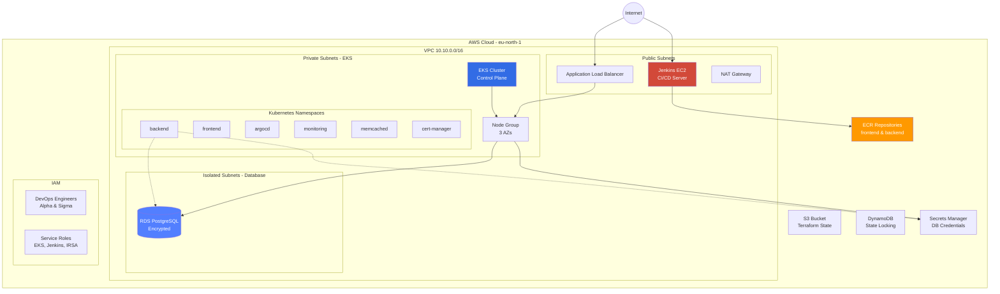
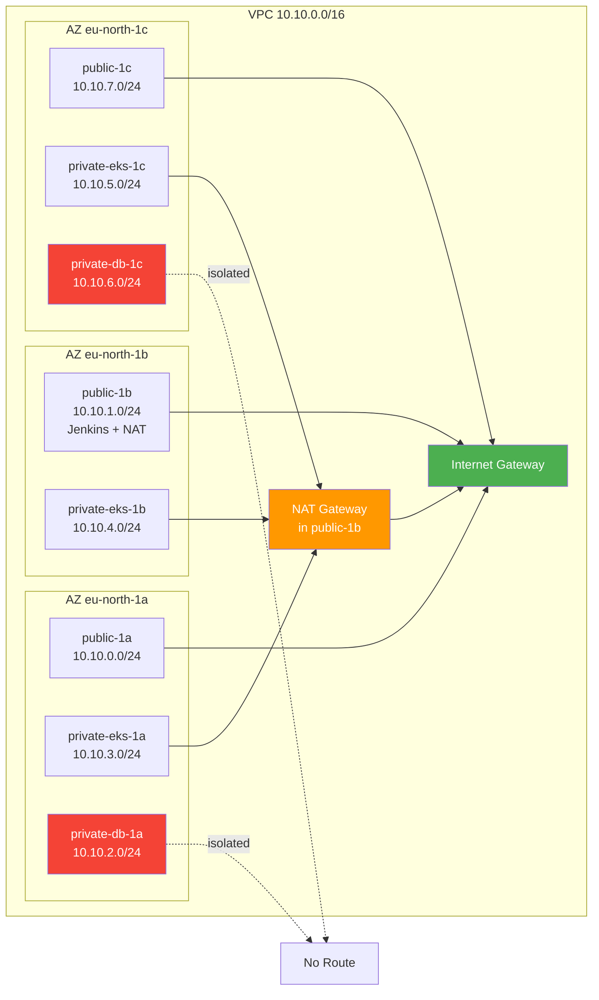
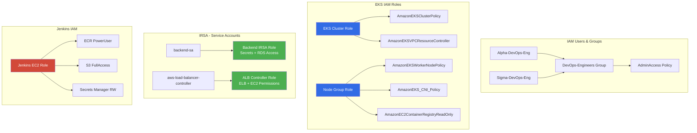

# Gig Router DevOps - Terraform Infrastructure

> **Production-grade AWS infrastructure provisioning for the Gig Router platform using Terraform**

## 📋 Table of Contents

- [Overview](#overview)
- [Architecture](#architecture)
- [Project Structure](#project-structure)
- [Infrastructure Components](#infrastructure-components)
- [Modules Reference](#modules-reference)
- [Prerequisites](#prerequisites)
- [Deployment Guide](#deployment-guide)
- [Configuration](#configuration)
- [Security](#security)
- [Troubleshooting](#troubleshooting)

---

## Overview

This repository contains the complete Terraform infrastructure-as-code (IaC) for the **Gig Router DevOps project**. It provisions a production-ready AWS environment centered around Amazon EKS (Elastic Kubernetes Service) with supporting services for CI/CD, networking, databases, and container registries.

### Design Principles

- **Modular Architecture**: 17 reusable Terraform modules for maximum flexibility
- **Explicit Configuration**: No implicit AWS defaults; everything is explicitly defined
- **Security First**: IAM least privilege, network isolation, encryption at rest
- **Multi-Environment Ready**: Designed for dev, staging, and production deployments
- **GitOps Ready**: Prepared for ArgoCD and continuous deployment workflows

### Key Features

✅ **Amazon EKS** cluster with managed node groups  
✅ **Multi-AZ networking** with public, private, and isolated subnets  
✅ **RDS PostgreSQL** database with automated backups  
✅ **ECR repositories** for frontend and backend containers  
✅ **Jenkins CI/CD** server on EC2  
✅ **IRSA** (IAM Roles for Service Accounts) for secure pod authentication  
✅ **Remote state management** with S3 and DynamoDB  
✅ **Comprehensive IAM** setup for users, groups, and service roles

---

## Architecture

### High-Level Infrastructure



### Network Topology



### IAM Architecture



---

## Project Structure

```
Terraform-Infra/
├── eks infra/                    # Main EKS infrastructure
│   ├── main.tf                   # Primary infrastructure definition (854 lines)
│   ├── variables.tf              # Input variables
│   ├── outputs.tf                # Output values
│   └── provider.tf               # AWS provider configuration
│
├── stand-alone-jenkins-server/   # Standalone Jenkins setup
│   ├── main.tf                   # Jenkins in separate VPC
│   ├── variables.tf
│   ├── outputs.tf
│   └── provider.tf
│
├── terraform-backend/            # Remote state management
│   ├── main.tf                   # S3 bucket + DynamoDB table
│   ├── variables.tf
│   └── provider.tf
│
└── modules/                      # 17 reusable modules
    ├── ec2/                      # EC2 instance provisioning
    ├── ecr/                      # ECR repository management
    ├── eks/                      # EKS cluster + node groups
    ├── eks-irsa/                 # IRSA role creation
    ├── eks-namespace/            # Kubernetes namespace management
    ├── eks-network/              # VPC, subnets, routing, NAT
    ├── iam-group/                # IAM group creation
    ├── iam-group-policy-attachment/
    ├── iam-policy/               # Custom IAM policies
    ├── iam-role/                 # IAM role creation
    ├── iam-role-policy-attachment/
    ├── iam-user/                 # IAM user creation
    ├── iam-user-group-membership/
    ├── rds/                      # RDS database instances
    ├── secret-manager/           # AWS Secrets Manager
    ├── security-group/           # Security group creation
    └── security-group-rule/      # Security group rules
```

---

## Infrastructure Components

### 1. **eks infra/** - Main EKS Infrastructure

The primary infrastructure deployment that provisions a complete production environment.

#### Components Provisioned

**IAM Setup**
- **DevOps Engineers Group**: Admin access for team members
- **Users**: Alpha-DevOps-Eng, Sigma-DevOps-Eng
- **EKS Cluster Role**: Control plane permissions
- **Node Group Role**: Worker node permissions
- **Jenkins EC2 Role**: ECR push, S3, Secrets Manager access
- **IRSA Roles**: Backend service account, ALB controller

**Networking (VPC 10.10.0.0/16)**
- **3 Public Subnets** (1a, 1b, 1c): ALB, Jenkins, NAT Gateway
- **3 Private EKS Subnets** (1a, 1b, 1c): EKS worker nodes
- **2 Isolated DB Subnets** (1a, 1c): RDS PostgreSQL
- **1 Internet Gateway**: Public subnet internet access
- **1 NAT Gateway** (in 1b): Private subnet outbound access

**EKS Cluster**
- **Kubernetes Version**: Configurable (variable)
- **Node Group**: Managed, multi-AZ deployment
- **IRSA Enabled**: IAM roles for service accounts
- **Cluster Logging**: API, audit, authenticator, controller, scheduler

**Kubernetes Namespaces**
- `argocd` - GitOps continuous deployment
- `monitoring` - Observability stack
- `backend` - Backend application
- `frontend` - Frontend application
- `memcached` - Caching layer
- `cert-manager` - TLS certificate management

**RDS PostgreSQL**
- **Engine**: PostgreSQL 14.15
- **Instance**: db.t3.micro (configurable)
- **Storage**: 20GB GP3, encrypted
- **Availability**: Single-AZ (eu-north-1a)
- **Backups**: Disabled (non-prod)
- **Access**: Private, from EKS nodes only

**ECR Repositories**
- `gig-router-frontend` - Frontend container images
- `gig-router-backend` - Backend container images
- **Features**: Image scanning, mutable tags, force delete

**Jenkins CI/CD Server**
- **Instance**: EC2 m7i-flex.large in public subnet
- **Access**: SSH (22), Web UI (8080)
- **Permissions**: ECR push, S3 access, Secrets Manager

**Security Groups**
- `rds-sg`: PostgreSQL (5432) from EKS nodes only
- `jenkins-sg`: SSH (22), HTTP (8080) from anywhere
- `eks-node-sg` (auto-created): SSH, HTTPS, NodePort services

### 2. **stand-alone-jenkins-server/** - Standalone Jenkins

Alternative Jenkins deployment in a separate VPC, useful for:
- Testing CI/CD pipelines independently
- Multi-region deployments
- Isolated build environments

**Components**
- Dedicated VPC with single public subnet
- Jenkins EC2 instance with full internet access
- IAM role with ECR, S3, and Secrets Manager permissions

### 3. **terraform-backend/** - Remote State Management

Infrastructure for storing Terraform state remotely with locking.

**Components**
- **S3 Bucket**: Versioned, encrypted, public access blocked
- **DynamoDB Table**: State locking with `LockID` hash key
- **Billing**: Pay-per-request (cost-optimized)

**Usage**: Must be deployed first before other infrastructure.

### 4. **modules/** - Reusable Terraform Modules

17 specialized modules that encapsulate AWS resource management.

---

## Modules Reference

| Module | Purpose | Key Resources | Inputs | Outputs |
|--------|---------|---------------|--------|---------|
| **ec2** | EC2 instance provisioning | `aws_instance`, `aws_iam_instance_profile` | `instances` (map), `tags` | `instance_ids`, `public_ips`, `private_ips` |
| **ecr** | Container registry | `aws_ecr_repository` | `repositories` (map), `region` | `repository_urls`, `repository_arns` |
| **eks** | EKS cluster + node groups | `aws_eks_cluster`, `aws_eks_node_group` | `clusters` (map), `tags` | `cluster_name`, `cluster_endpoint`, `cluster_ca` |
| **eks-irsa** | IRSA role creation | `aws_iam_role`, `kubernetes_service_account` | `service_accounts` (map), `cluster_oidc_issuer` | `role_arns`, `service_account_names` |
| **eks-namespace** | K8s namespace management | `kubernetes_namespace` | `namespaces` (map), `default_labels` | `namespace_names` |
| **eks-network** | VPC, subnets, routing | `aws_vpc`, `aws_subnet`, `aws_nat_gateway`, `aws_route_table` | `vpc_cidr`, `subnets` (map), `nat_gateways` (map) | `vpc_id`, `subnet_ids`, `nat_gateway_ids` |
| **iam-group** | IAM group creation | `aws_iam_group` | `groups` (map) | `group_names`, `group_arns` |
| **iam-group-policy-attachment** | Attach policies to groups | `aws_iam_group_policy_attachment` | `attachments` (map) | `attachment_ids` |
| **iam-policy** | Custom IAM policies | `aws_iam_policy` | `policies` (map) | `policy_arns`, `policy_names` |
| **iam-role** | IAM role creation | `aws_iam_role` | `name`, `assume_role_policy` | `arn`, `name` |
| **iam-role-policy-attachment** | Attach policies to roles | `aws_iam_role_policy_attachment` | `role_name`, `policy_arns` (list) | `attachment_ids` |
| **iam-user** | IAM user creation | `aws_iam_user` | `users` (map) | `user_names`, `user_arns` |
| **iam-user-group-membership** | Add users to groups | `aws_iam_user_group_membership` | `memberships` (map) | `membership_ids` |
| **rds** | RDS database instances | `aws_db_instance`, `aws_db_subnet_group` | `db_instances` (map), `region` | `db_instance_addresses`, `db_instance_endpoints` |
| **secret-manager** | AWS Secrets Manager | `aws_secretsmanager_secret`, `aws_secretsmanager_secret_version` | `secrets` (map) | `secret_arns`, `secret_names` |
| **security-group** | Security group creation | `aws_security_group` | `security_groups` (map), `vpc_id` | `security_group_ids` |
| **security-group-rule** | Security group rules | `aws_security_group_rule` | `rules` (map) | `rule_ids` |

### Module Usage Example

```hcl
# Using the eks-network module
module "eks_network" {
  source = "../modules/eks-network"

  region             = "eu-north-1"
  vpc_cidr           = "10.10.0.0/16"
  enable_dns_support = true
  enable_dns_hostnames = true

  subnets = {
    public-1a = {
      cidr_block        = "10.10.0.0/24"
      availability_zone = "eu-north-1a"
      type              = "public"
      tier              = "alb"
      tags              = { "kubernetes.io/role/elb" = "1" }
    }
    private-eks-1a = {
      cidr_block        = "10.10.3.0/24"
      availability_zone = "eu-north-1a"
      type              = "private"
      tier              = "eks"
      tags              = { "kubernetes.io/role/internal-elb" = "1" }
    }
  }

  nat_gateways = {
    nat-1b = {
      subnet_key = "public-1b"
      tags       = { AZ = "eu-north-1b" }
    }
  }

  tags = { Project = "gig-router", Environment = "production" }
}
```

---

## Prerequisites

### Required Tools

- **Terraform**: >= 1.5.0
- **AWS CLI**: >= 2.x
- **kubectl**: >= 1.28 (for EKS cluster access)
- **Git**: For version control

### AWS Account Requirements

- Active AWS account with appropriate permissions
- AWS credentials configured (`~/.aws/credentials` or environment variables)
- Sufficient service quotas for:
  - VPCs (1 per deployment)
  - EKS clusters (1)
  - NAT Gateways (1)
  - Elastic IPs (1)
  - RDS instances (1)

### Required IAM Permissions

The deploying user/role needs permissions for:
- EC2 (VPC, subnets, security groups, instances)
- EKS (cluster, node groups)
- RDS (instances, subnet groups)
- ECR (repositories)
- IAM (users, groups, roles, policies)
- S3 (buckets)
- DynamoDB (tables)
- Secrets Manager (secrets)

### Environment Setup

```bash
# Configure AWS credentials
aws configure

# Verify AWS access
aws sts get-caller-identity

# Set environment variables (optional)
export AWS_REGION=eu-north-1
export TF_VAR_project_name=gig-router
export TF_VAR_environment=production
```

---

## Deployment Guide

### Phase 1: Backend Setup (First-Time Only)

Deploy the Terraform backend to store state remotely.

```bash
# Navigate to backend directory
cd terraform-backend

# Initialize Terraform
terraform init

# Review the plan
terraform plan

# Apply the backend infrastructure
terraform apply

# Note the S3 bucket and DynamoDB table names from outputs
```

**Outputs to save:**
- `s3_bucket_name`: For backend configuration
- `dynamodb_table_name`: For state locking

### Phase 2: Configure Remote Backend

Update `eks infra/provider.tf` to use the remote backend:

```hcl
terraform {
  backend "s3" {
    bucket         = "your-terraform-state-bucket"  # From Phase 1 output
    key            = "eks-infra/terraform.tfstate"
    region         = "eu-north-1"
    dynamodb_table = "your-terraform-locks-table"   # From Phase 1 output
    encrypt        = true
  }
}
```

### Phase 3: Deploy Main Infrastructure

```bash
# Navigate to EKS infrastructure directory
cd "eks infra"

# Initialize Terraform with remote backend
terraform init

# Validate configuration
terraform validate

# Review the execution plan
terraform plan -out=tfplan

# Apply the infrastructure
terraform apply tfplan
```

**Deployment time**: ~15-20 minutes (EKS cluster creation is the longest)

### Phase 4: Post-Deployment Configuration

#### Configure kubectl Access

```bash
# Update kubeconfig for EKS cluster
aws eks update-kubeconfig \
  --region eu-north-1 \
  --name gig-router-eks-cluster

# Verify cluster access
kubectl get nodes
kubectl get namespaces
```

#### Verify Infrastructure

```bash
# Check EKS cluster status
aws eks describe-cluster --name gig-router-eks-cluster --region eu-north-1

# Check RDS instance
aws rds describe-db-instances --region eu-north-1

# Check ECR repositories
aws ecr describe-repositories --region eu-north-1

# Get Jenkins public IP
terraform output jenkins_public_ip
```

#### Access Jenkins

```bash
# Get Jenkins public IP from Terraform output
JENKINS_IP=$(terraform output -raw jenkins_public_ip)

# Access Jenkins UI
echo "Jenkins URL: http://${JENKINS_IP}:8080"

# SSH to Jenkins (if needed)
ssh -i /path/to/key.pem ec2-user@${JENKINS_IP}
```

### Phase 5: Deploy Applications (Optional)

Once infrastructure is ready, deploy your applications:

```bash
# Example: Deploy backend application
kubectl apply -f k8s-manifests/backend/ -n backend

# Example: Deploy frontend application
kubectl apply -f k8s-manifests/frontend/ -n frontend
```

---

## Configuration

### Key Variables

Edit `eks infra/variables.tf` or create a `terraform.tfvars` file:

```hcl
# Project Configuration
project_name = "gig-router"
environment  = "production"
region       = "eu-north-1"

# Network Configuration
vpc_cidr        = "10.10.0.0/16"
public_subnets  = ["10.10.0.0/24", "10.10.1.0/24", "10.10.7.0/24"]
eks_subnets     = ["10.10.3.0/24", "10.10.4.0/24", "10.10.5.0/24"]
rds_subnets     = ["10.10.2.0/24", "10.10.6.0/24"]

# EKS Configuration
eks_cluster_name        = "gig-router-eks-cluster"
eks_node_group_name     = "gig-router-node-group"
eks_kubernetes_version  = "1.28"
eks_node_instance_type  = "t3.medium"
eks_node_count          = 2
eks_node_disk_size      = 20

# RDS Configuration
db_instance  = "gig-router-db"
db_name      = "gigrouter"
db_username  = "dbadmin"

# EC2 Configuration
ami_id = "ami-xxxxxxxxxxxxxxxxx"  # Amazon Linux 2 AMI for eu-north-1
```

### Multi-Environment Setup

Create separate variable files for each environment:

```bash
# Development
terraform apply -var-file="environments/dev.tfvars"

# Staging
terraform apply -var-file="environments/staging.tfvars"

# Production
terraform apply -var-file="environments/prod.tfvars"
```

### Cost Optimization

**Free Tier / Low Cost Options:**
- Use `t3.micro` for EKS nodes (development)
- Single-AZ RDS deployment
- Disable RDS backups (non-production)
- Use spot instances for node groups (variable cost)

**Production Recommendations:**
- Multi-AZ RDS for high availability
- Enable automated backups (7-day retention)
- Use reserved instances for predictable workloads
- Enable EKS cluster autoscaling

---

## Security

### Network Security

- **Private Subnets**: EKS nodes and RDS in private subnets with no direct internet access
- **NAT Gateway**: Controlled outbound internet access for private resources
- **Security Groups**: Least privilege ingress/egress rules
- **Isolated Subnets**: Database subnets have no route to internet

### IAM Security

- **Least Privilege**: Each role has only necessary permissions
- **IRSA**: Kubernetes pods use IAM roles instead of node instance profiles
- **No Hardcoded Credentials**: All secrets in AWS Secrets Manager
- **MFA Recommended**: Enable MFA for DevOps engineer users

### Data Security

- **Encryption at Rest**: RDS storage encrypted with AWS KMS
- **Encryption in Transit**: TLS for all API communications
- **Secrets Management**: Database credentials in Secrets Manager
- **S3 Versioning**: Terraform state versioning enabled

### Best Practices

1. **Rotate Credentials**: Regularly rotate IAM access keys and database passwords
2. **Enable CloudTrail**: Audit all API calls for compliance
3. **Use Private Endpoints**: VPC endpoints for AWS services (S3, ECR, Secrets Manager)
4. **Network Policies**: Implement Kubernetes network policies for pod-to-pod communication
5. **Image Scanning**: ECR image scanning enabled on push

---

## Troubleshooting

### Common Issues

#### 1. EKS Cluster Creation Fails

**Symptom**: `Error creating EKS Cluster: InvalidParameterException`

**Solution**:
- Verify subnet tags include `kubernetes.io/cluster/<cluster-name> = shared`
- Ensure subnets span at least 2 availability zones
- Check IAM role trust relationships

#### 2. Nodes Not Joining Cluster

**Symptom**: `kubectl get nodes` shows no nodes

**Solution**:
```bash
# Check node group status
aws eks describe-nodegroup \
  --cluster-name gig-router-eks-cluster \
  --nodegroup-name gig-router-node-group

# Check CloudWatch logs for node group
# Verify node IAM role has required policies
```

#### 3. RDS Connection Timeout

**Symptom**: Applications can't connect to RDS

**Solution**:
- Verify security group allows PostgreSQL (5432) from EKS node security group
- Check RDS is in private subnets
- Verify subnet route tables

#### 4. Terraform State Lock

**Symptom**: `Error acquiring the state lock`

**Solution**:
```bash
# Force unlock (use with caution)
terraform force-unlock <LOCK_ID>

# Or manually delete lock from DynamoDB table
aws dynamodb delete-item \
  --table-name terraform-locks \
  --key '{"LockID": {"S": "terraform-state-lock-id"}}'
```

#### 5. IRSA Not Working

**Symptom**: Pods can't assume IAM roles

**Solution**:
- Verify OIDC provider is created for EKS cluster
- Check service account annotations: `eks.amazonaws.com/role-arn`
- Verify IAM role trust policy includes OIDC provider
- Wait 90 seconds after cluster creation for OIDC to be available

### Debugging Commands

```bash
# Check Terraform state
terraform state list
terraform state show <resource>

# Validate Terraform configuration
terraform validate
terraform fmt -check

# Check AWS resources
aws eks list-clusters
aws rds describe-db-instances
aws ecr describe-repositories

# Kubernetes debugging
kubectl get pods --all-namespaces
kubectl describe pod <pod-name> -n <namespace>
kubectl logs <pod-name> -n <namespace>
```

### Resource Cleanup

To destroy all infrastructure:

```bash
# Destroy EKS infrastructure
cd "eks infra"
terraform destroy

# Destroy backend (optional - only if completely removing project)
cd ../terraform-backend
terraform destroy
```

> ⚠️ **Warning**: `terraform destroy` will delete all resources including databases. Ensure you have backups!

---

## Cost Estimation

### Monthly Cost Breakdown (Approximate)

| Service | Configuration | Estimated Cost |
|---------|---------------|----------------|
| EKS Control Plane | 1 cluster | $72/month |
| EC2 (EKS Nodes) | 2x t3.medium | ~$60/month |
| NAT Gateway | 1 gateway + data transfer | ~$35/month |
| RDS PostgreSQL | db.t3.micro, 20GB | ~$15/month |
| Jenkins EC2 | m7i-flex.large | ~$50/month |
| ECR | Storage + data transfer | ~$5/month |
| S3 + DynamoDB | State storage | <$1/month |
| **Total** | | **~$238/month** |

> 💡 **Cost Optimization**: Use spot instances, stop Jenkins when not in use, use smaller instance types for dev/staging.

---

## License

This project is maintained for educational purposes as part of the NTI DevOps training program.

---


**Last Updated**: 2026-02-10  
**Maintained By**: Abdelaziz Ak  
**Terraform Version**: 1.5+  
**AWS Region**: eu-north-1
