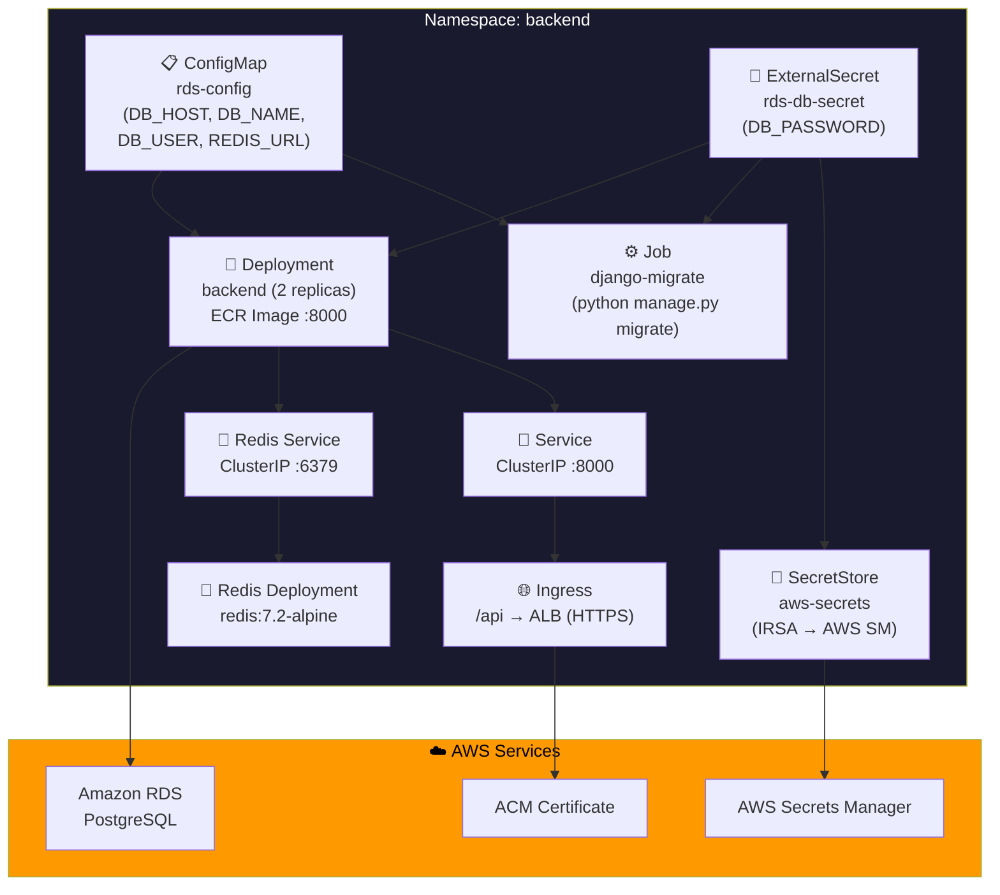
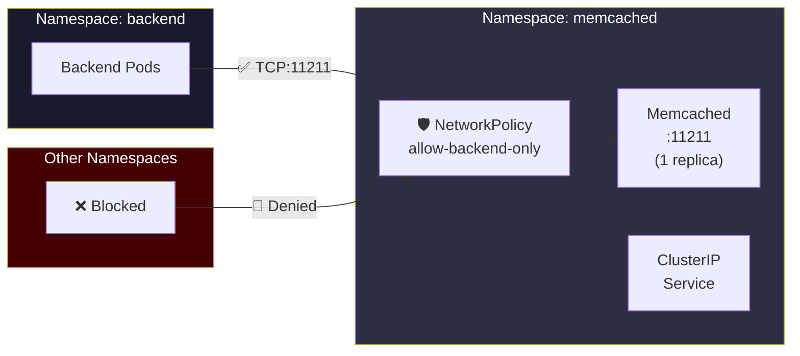
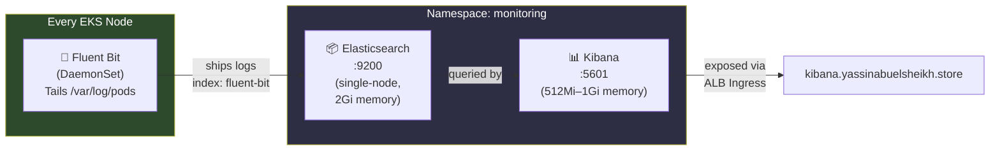
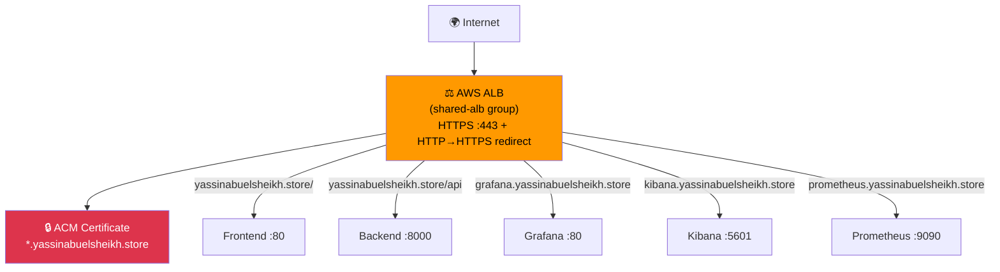
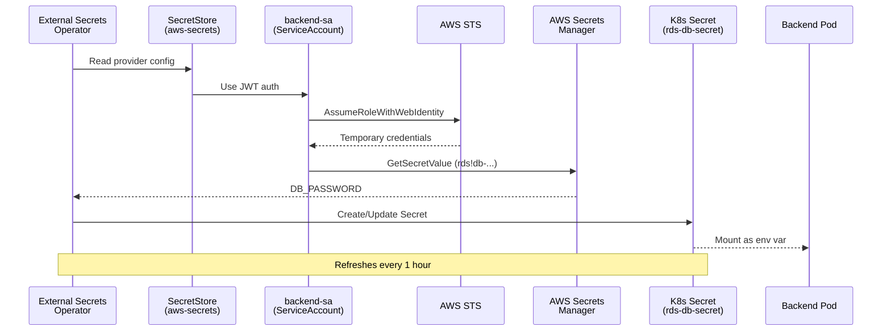
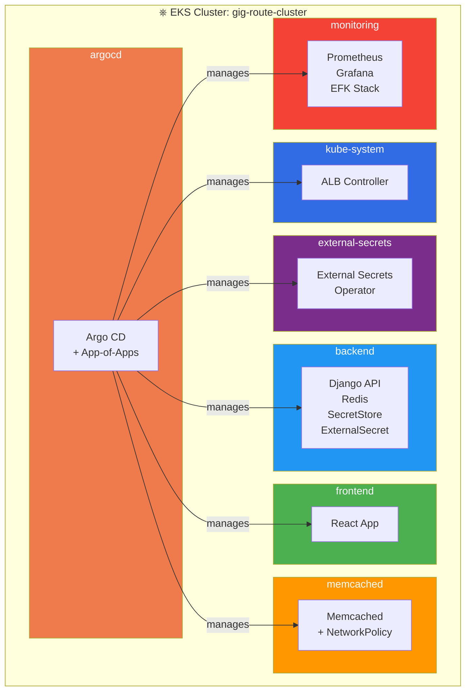
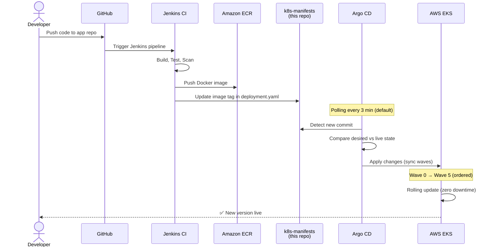

<p align="center">
  
  &nbsp;&nbsp;&nbsp;
  
</p>

<h1 align="center">🚀 Gig Router — Kubernetes Manifests</h1>

<p align="center">
  <b>GitOps-Driven Kubernetes Deployment on AWS EKS, Orchestrated by Argo CD</b>
</p>

<p align="center">
  
  
  
  
  
  
</p>

---

## 📖 Table of Contents

- [Project Overview](#-project-overview)
- [Architecture Overview](#-architecture-overview)
- [Argo CD — The GitOps Engine](#-argo-cd--the-gitops-engine)
- [Sync Wave Orchestration Strategy](#-sync-wave-orchestration-strategy)
- [Repository Structure](#-repository-structure)
- [Directory Deep Dive](#-directory-deep-dive)
  - [argocd/ — App-of-Apps Control Plane](#-argocd--app-of-apps-control-plane)
  - [backend/ — Django API Layer](#-backend--django-api-layer)
  - [frontend/ — React UI Layer](#-frontend--react-ui-layer)
  - [memcached/ — Caching Layer](#-memcached--caching-layer)
  - [logging/ — EFK Stack](#-logging--efk-stack)
  - [observability/ — Prometheus & Grafana](#-observability--prometheus--grafana)
- [Networking & Ingress Strategy](#-networking--ingress-strategy)
- [Secrets Management Strategy](#-secrets-management-strategy)
- [Namespace Isolation Strategy](#-namespace-isolation-strategy)
- [End-to-End Deployment Flow](#-end-to-end-deployment-flow)
- [Key Technologies](#-key-technologies)

---

## 🌐 Project Overview

The **Gig Router** is a full-stack freelancing platform built with **Django (Backend)** and **React (Frontend)**, deployed as microservices on **AWS EKS** (Elastic Kubernetes Service). This repository contains all Kubernetes manifests that define the desired state of the entire platform infrastructure.

Every component — from the application workloads to the monitoring and logging stacks — is **declaratively defined** in this repository and **automatically synced** to the live cluster by **Argo CD**, following the **GitOps** paradigm:

> 💡 **GitOps Principle:** *Git is the single source of truth. Every change to the cluster flows through a Git commit — no manual `kubectl apply`, no drift, no surprises.*

### What This Repository Manages

| Concern | Components | Namespace |
|---------|-----------|-----------|
| 🖥️ **Application** | Django Backend (2 replicas) + Redis | `backend` |
| 🎨 **Frontend** | React App (2 replicas) | `frontend` |
| 💾 **Caching** | Memcached (network-isolated) | `memcached` |
| 📊 **Monitoring** | Prometheus + Grafana + Kube State Metrics + Node Exporter | `monitoring` |
| 📝 **Logging** | Elasticsearch + Fluent Bit + Kibana (EFK) | `monitoring` |
| 🔐 **Secrets** | External Secrets Operator → AWS Secrets Manager | `external-secrets` / `backend` |
| 🌐 **Networking** | AWS ALB Ingress Controller + Shared ALB | `kube-system` |
| 🔄 **GitOps** | Argo CD App-of-Apps | `argocd` |

---

## 🏗️ Architecture Overview

```
                            ┌─────────────────────────────────────────────────────────┐
                            │                    AWS CLOUD (eu-north-1)               │
                            │                                                         │
  ┌──────────┐   HTTPS      │  ┌───────────────────────────────────────────────────┐   │
  │  Users / │──────────────│──│              AWS ALB (Shared)                     │   │
  │ Browsers │              │  │   yassinabuelsheikh.store (Frontend + Backend)    │   │
  └──────────┘              │  │   grafana.yassinabuelsheikh.store                 │   │
                            │  │   kibana.yassinabuelsheikh.store                  │   │
                            │  │   prometheus.yassinabuelsheikh.store              │   │
                            │  └────┬──────────┬──────────┬──────────┬─────────────┘   │
                            │       │          │          │          │                  │
                            │  ┌────▼──┐  ┌────▼──┐  ┌───▼───┐  ┌──▼────┐             │
                            │  │Frontend│  │Backend│  │Grafana│  │Kibana │             │
                            │  │  :80   │  │ :8000 │  │  :80  │  │ :5601 │             │
                            │  │(2 pods)│  │(2 pods)│  └───┬───┘  └──┬────┘             │
                            │  └────────┘  └───┬────┘      │         │                 │
                            │                  │      ┌────▼─────────▼──┐              │
                            │         ┌────────┤      │   Prometheus    │              │
                            │         │        │      │    :9090        │              │
                            │    ┌────▼──┐  ┌──▼──┐   └─────────────────┘              │
                            │    │ Redis │  │ RDS │                                    │
                            │    │ :6379 │  │(AWS)│   ┌─────────────────┐              │
                            │    └───────┘  └─────┘   │  Elasticsearch  │              │
                            │                         │     :9200       │              │
                            │    ┌──────────┐         └────────▲────────┘              │
                            │    │Memcached │              ┌───┴────┐                  │
                            │    │  :11211  │              │Fluent  │                  │
                            │    └──────────┘              │  Bit   │                  │
                            │                              │(Daemon)│                  │
                            │  ┌──────────────────┐        └────────┘                  │
                            │  │   Argo CD        │                                    │
                            │  │  (GitOps Engine) │──── watches ──── GitHub repo       │
                            │  └──────────────────┘                                    │
                            │                                                         │
                            │  ┌──────────────────────────────────────────────┐        │
                            │  │         AWS Secrets Manager                  │        │
                            │  │  (RDS credentials via External Secrets)     │        │
                            │  └──────────────────────────────────────────────┘        │
                            └─────────────────────────────────────────────────────────┘
```

---

## 🔄 Argo CD — The GitOps Engine

Argo CD is the **brain** of this deployment. It continuously monitors this Git repository and automatically reconciles the live cluster state to match what's declared here.

### How Argo CD Works in This Project

```mermaid
flowchart LR
    subgraph GitHub["☁️ GitHub Repository"]
        A["k8s-manifests repo<br/>(main branch)"]
    end

    subgraph ArgoCD["🔄 Argo CD (argocd namespace)"]
        B["Platform App<br/>(App-of-Apps)"]
    end

    subgraph EKS["⎈ AWS EKS Cluster"]
        C["Wave 0: ALB Controller"]
        D["Wave 1: Prometheus CRDs"]
        E["Wave 2: External Secrets"]
        F["Wave 3: Monitoring + Memcached"]
        G["Wave 4: Backend + Logging"]
        H["Wave 5: Frontend"]
    end

    A -- "watches" --> B
    B -- "deploys in order" --> C
    C --> D --> E --> F --> G --> H

    style GitHub fill:#24292e,color:#fff
    style ArgoCD fill:#EF7B4D,color:#fff
    style EKS fill:#326CE5,color:#fff
```



### App-of-Apps Pattern

This project uses Argo CD's **App-of-Apps** pattern — a single "parent" application (`platform`) that manages all other applications:

```
platform (apps.yaml)
├── aws-load-balancer-controller   ← Wave 0 (Helm chart)
├── prometheus-crds                ← Wave 1 (Helm chart)
├── external-secrets               ← Wave 2 (Helm chart)
├── monitoring                     ← Wave 3 (Helm multi-source)
├── memcached                      ← Wave 3 (Git manifests)
├── backend                        ← Wave 4 (Git manifests)
├── logging                        ← Wave 4 (Git manifests)
└── frontend                       ← Wave 5 (Git manifests)
```

> 🔑 **Key Benefits:**  
> - **Single entry point** — deploy the entire platform with one Argo CD Application  
> - **Self-healing** — if someone manually changes the cluster, Argo CD reverts it  
> - **Auto-pruning** — removed manifests are automatically cleaned from the cluster  
> - **Orchestrated rollouts** — sync waves ensure dependencies deploy before dependents  

### Sync Policy (All Applications)

Every Argo CD Application in this project uses the same aggressive sync policy:

```yaml
syncPolicy:
  automated:
    prune: true      # Delete resources removed from Git
    selfHeal: true   # Revert manual cluster changes
```

This means:
- ✅ **Automated sync** — changes merge to `main` → cluster updates automatically  
- ✅ **Prune enabled** — delete a YAML → resource is removed from the cluster  
- ✅ **Self-heal enabled** — manual `kubectl edit` → Argo CD reverts it immediately  

---

## 🌊 Sync Wave Orchestration Strategy

Sync waves control **deployment order**. Lower numbers deploy first. This ensures infrastructure-level dependencies are ready before application workloads are deployed.

```mermaid
gantt
    title Argo CD Sync Wave Deployment Order
    dateFormat X
    axisFormat %s

    section Wave 0 — Networking
    AWS ALB Controller (Helm)           :w0, 0, 1

    section Wave 1 — CRDs
    Prometheus CRDs (Helm)              :w1, 1, 2

    section Wave 2 — Security
    External Secrets Operator (Helm)    :w2, 2, 3

    section Wave 3 — Platform Services
    Monitoring Stack (Helm multi-src)   :w3, 3, 4
    Memcached Cluster                   :w3b, 3, 4

    section Wave 4 — Application
    Backend + Redis + Migration Job     :w4, 4, 5
    EFK Logging Stack                   :w4b, 4, 5

    section Wave 5 — Frontend
    React Frontend                      :w5, 5, 6
```



### Why This Order?

| Wave | What Deploys | Why It Must Be First |
|------|-------------|---------------------|
| **0** | AWS ALB Controller | Ingress resources need the ALB controller to provision load balancers |
| **1** | Prometheus CRDs | ServiceMonitor and PrometheusRule CRDs must exist before the monitoring stack references them |
| **2** | External Secrets Operator | The operator must be running before SecretStore/ExternalSecret resources in backend can be processed |
| **3** | Monitoring + Memcached | Platform services that the application layer depends on for caching and observability |
| **4** | Backend + Logging | Django API (depends on secrets from Wave 2, caching from Wave 3) + EFK log collection |
| **5** | Frontend | React app — depends on a healthy backend to route API calls to |

---

## 📁 Repository Structure

```
k8s-manifests/
│
├── 📂 argocd/                          # 🔄 Argo CD Application Definitions
│   ├── apps.yaml                       #    App-of-Apps root (platform)
│   ├── aws-loadbalancer.yaml           #    Wave 0 — ALB Controller (Helm)
│   ├── prometheus-crds.yaml            #    Wave 1 — Prometheus CRDs (Helm)
│   ├── cert-manager.yaml               #    (disabled) TLS certificate automation
│   ├── external-secrets-app.yaml       #    Wave 2 — External Secrets Operator (Helm)
│   ├── monitoring-helm.yaml            #    Wave 3 — Prometheus + Grafana (Helm multi-source)
│   ├── memcached-app.yaml              #    Wave 3 — Memcached (Git)
│   ├── backend-app.yaml                #    Wave 4 — Backend (Git)
│   ├── logging-app.yaml                #    Wave 4 — EFK Logging (Git)
│   └── frontend-app.yaml              #    Wave 5 — Frontend (Git)
│
├── 📂 backend/                         # 🖥️ Django Backend Manifests
│   ├── configMap.yaml                  #    RDS connection config (host, db, user, redis)
│   ├── SecretStore.yaml                #    AWS Secrets Manager provider (via IRSA)
│   ├── ExternalSecret.yaml             #    Pulls DB_PASSWORD from AWS Secrets Manager
│   ├── job.yaml                        #    Django migration Job (runs before deployment)
│   ├── deployment.yaml                 #    Backend Deployment (2 replicas, ECR image)
│   ├── service.yaml                    #    ClusterIP Service (:8000)
│   ├── ingress.yaml                    #    ALB Ingress (HTTPS, /api path)
│   ├── redis.yaml                      #    Redis Deployment (cache layer)
│   └── redis-service.yaml              #    Redis ClusterIP Service (:6379)
│
├── 📂 frontend/                        # 🎨 React Frontend Manifests
│   ├── deployment.yaml                 #    Frontend Deployment (2 replicas)
│   ├── service.yaml                    #    ClusterIP Service (:80)
│   └── ingress.yaml                    #    ALB Ingress (HTTPS, / path)
│
├── 📂 memcached/                       # 💾 Memcached Caching Layer
│   ├── deployment.yaml                 #    Memcached Deployment (1 replica)
│   ├── service.yaml                    #    ClusterIP Service (:11211)
│   └── networkpolicy.yaml              #    Network Policy — backend-only access
│
├── 📂 logging/                         # 📝 EFK Stack (Centralized Logging)
│   ├── elasticsearch.yaml              #    Elasticsearch Deployment + Service
│   ├── fluentd.yaml                    #    Fluent Bit DaemonSet (log shipper)
│   ├── kibana.yaml                     #    Kibana Deployment + Service
│   └── ingress.yaml                    #    ALB Ingress (Grafana, Kibana, Prometheus)
│
└── 📂 observability/                   # 📊 Prometheus Stack Configuration
    └── values.yaml                     #    Helm values for kube-prometheus-stack
```

---

## 📂 Directory Deep Dive

### 🔄 `argocd/` — App-of-Apps Control Plane

This is the **nerve center** of the entire deployment. Every YAML file here is an Argo CD `Application` resource that tells Argo CD what to deploy, where to find it, and how to sync it.

#### Source Types

The Argo CD applications in this project pull from **two types of sources**:

| Type | Source | Used By |
|------|--------|---------|
| **Helm Charts** | External Helm repositories | ALB Controller, External Secrets, Prometheus CRDs, Monitoring |
| **Git Manifests** | This GitHub repository (`k8s-manifests`) | Backend, Frontend, Memcached, Logging |

#### File-by-File Breakdown

<details>
<summary><b>📄 apps.yaml — The Root Application</b></summary>

The **App-of-Apps** parent. This single Application watches the `argocd/` directory of this repo and deploys all other Application resources found within it.

```yaml
# Source: argocd/ directory of this repo
# Destination: argocd namespace
# Effect: Deploys all child Application manifests
```

**Strategy:** By deploying this one app, Argo CD discovers all other `Application` YAMLs in the `argocd/` folder and creates them — bootstrapping the entire platform.

</details>

<details>
<summary><b>📄 aws-loadbalancer.yaml — Wave 0: AWS ALB Controller</b></summary>

Deploys the **AWS Load Balancer Controller** via Helm from the official `eks-charts` repository.

| Parameter | Value |
|-----------|-------|
| Chart | `aws-load-balancer-controller` v3.0.0 |
| Cluster | `gig-route-cluster` |
| Region | `eu-north-1` |
| VPC | `vpc-04bfe886a3143adb7` |
| Service Account | Pre-created `aws-load-balancer-controller` (IRSA) |
| Namespace | `kube-system` |

**Why Wave 0?** All Ingress resources across the project depend on this controller to provision Application Load Balancers.

</details>

<details>
<summary><b>📄 prometheus-crds.yaml — Wave 1: Prometheus CRDs</b></summary>

Pre-installs Prometheus Operator CRDs from the `kube-prometheus-stack` Helm chart with **ServerSideApply** enabled (required for large CRDs).

| Feature | Setting |
|---------|---------|
| Prune | `false` (never delete CRDs automatically) |
| Retry | 5 attempts with exponential backoff (10s → 3m) |
| Replace | `true` (force-replace large CRDs) |
| Finalizer | `resources-finalizer.argocd.argoproj.io` |

**Why Wave 1?** CRDs must exist before any `ServiceMonitor`, `PrometheusRule`, or `Prometheus` custom resources are created in Wave 3.

</details>

<details>
<summary><b>📄 external-secrets-app.yaml — Wave 2: External Secrets Operator</b></summary>

Installs the **External Secrets Operator** (ESO) via Helm chart (v0.9.13) with CRDs enabled.

**Why Wave 2?** The backend's `SecretStore` and `ExternalSecret` resources (Wave 4) require the ESO custom resource definitions and controller to be running first.

</details>

<details>
<summary><b>📄 monitoring-helm.yaml — Wave 3: Full Monitoring Stack</b></summary>

Deploys the **kube-prometheus-stack** (Prometheus + Grafana + AlertManager) using Argo CD's **multi-source** feature:

- **Source 1:** Helm chart from `prometheus-community` (v58.5.0)
- **Source 2:** Custom `values.yaml` from this repo (`observability/values.yaml`)

This is the most sophisticated Argo CD Application in the project — it references a values file from a separate Git source using the `$values` reference pattern.

</details>

<details>
<summary><b>📄 backend-app.yaml / frontend-app.yaml / memcached-app.yaml / logging-app.yaml</b></summary>

These four applications all follow the same pattern — they point to a **subdirectory** of this Git repository:

| App | Git Path | Target Namespace | Sync Wave |
|-----|----------|-------------------|-----------|
| `backend` | `backend/` | `backend` | 4 |
| `frontend` | `frontend/` | `frontend` | 5 |
| `memcached` | `memcached/` | `memcached` | 3 |
| `logging` | `logging/` | `monitoring` | 4 |

</details>

---

### 🖥️ `backend/` — Django API Layer

The backend directory contains the most complex set of manifests, implementing a **secure, database-connected Django API** with **Redis caching** and **automated database migrations**.



#### Internal Sync Wave (Within Backend Namespace)

Even within the backend directory, resources use **sync waves** to ensure correct ordering:

| Wave | Resource | Why |
|------|----------|-----|
| 0 | `ConfigMap` (rds-config) | Config values needed by everything else |
| 1 | `SecretStore` (aws-secrets) | Must exist before ExternalSecret can reference it |
| 2 | `ExternalSecret` (rds-db-secret) | Must resolve before Job/Deployment can read DB_PASSWORD |
| 3 | `Job` (django-migrate) | Database schema must be up-to-date before API serves traffic |
| 4 | `Deployment` (backend) | API pods start after migration completes |
| 5 | `Service` (backend) | Kubernetes service for the deployment |
| 6 | `Ingress` (backend-ingress) | Routes `/api` traffic from ALB |

#### Key Configuration

- **Image:** `231056963705.dkr.ecr.eu-north-1.amazonaws.com/gig-route-backend:39-ae9ef90` (Amazon ECR)
- **Replicas:** 2 (high availability)
- **Service Account:** `backend-sa` (IAM Roles for Service Accounts — IRSA)
- **Database:** Amazon RDS PostgreSQL at `gig-route.c1iuiewi0186.eu-north-1.rds.amazonaws.com`
- **Cache:** In-cluster Redis (redis:7.2-alpine) with resource limits (50m–200m CPU, 64Mi–256Mi memory)
- **Health Check:** ALB checks `/api/health/` for HTTP 200

---

### 🎨 `frontend/` — React UI Layer

The frontend is a streamlined deployment — a React application served via Nginx.

| Resource | Details |
|----------|---------|
| **Deployment** | 2 replicas, image: `mazenmostafa429/frontend:2`, port 3000 |
| **Service** | ClusterIP on port 80 (targets container port 80) |
| **Ingress** | ALB serving `yassinabuelsheikh.store` at `/` with HTTPS + SSL redirect |

> 📝 The frontend and backend share the **same domain** (`yassinabuelsheikh.store`) but are routed via **path-based routing**: 
> - `/` → Frontend
> - `/api` → Backend

---

### 💾 `memcached/` — Caching Layer

A dedicated caching layer isolated in its own namespace with **network policy enforcement**.



**Security Highlight:** The `NetworkPolicy` restricts Memcached access to **only** pods in the `backend` namespace. No other namespace can reach port 11211 — following the **principle of least privilege**.

---

### 📝 `logging/` — EFK Stack

Centralized log aggregation using the **EFK** (Elasticsearch, Fluent Bit, Kibana) stack, deployed in the `monitoring` namespace.



| Component | Type | Image | Key Config |
|-----------|------|-------|------------|
| **Elasticsearch** | Deployment (1 replica) | `elasticsearch:8.11.1` | Single-node, 512m JVM heap, security disabled, readiness probe on `/_cluster/health` |
| **Fluent Bit** | DaemonSet (all nodes) | `fluent-bit:2.2.2` | Tails `/var/log/pods/*/*/*.log`, ships to ES index `fluent-bit` |
| **Kibana** | Deployment (1 replica) | `kibana:8.11.1` | Connects to ES at `http://elasticsearch:9200`, 512Mi–1Gi memory, readiness on `/api/status` |

---

### 📊 `observability/` — Prometheus & Grafana

The `values.yaml` file customizes the **kube-prometheus-stack** Helm chart deployment. This is referenced by the `monitoring-helm.yaml` Argo CD Application using multi-source.

#### What's Enabled

| Component | Status | Configuration |
|-----------|--------|--------------|
| **Prometheus** | ✅ Enabled | 1 replica, 1–5 Gi memory, 3h retention, 200MB storage cap |
| **Grafana** | ✅ Enabled | Persistent storage (5Gi), admin via K8s secret, ALB ingress |
| **Kube State Metrics** | ✅ Enabled | 64–128 Mi memory, 50–100m CPU |
| **Node Exporter** | ✅ Enabled | 32–64 Mi memory, 50–100m CPU |
| **kubeEtcd** | ❌ Disabled | Not accessible in managed EKS |
| **kubeControllerManager** | ❌ Disabled | Not accessible in managed EKS |
| **kubeScheduler** | ❌ Disabled | Not accessible in managed EKS |
| **kubeProxy** | ❌ Disabled | Not accessible in managed EKS |
| **coreDns** | ❌ Disabled | Causes monitoring issues in EKS |

> ⚠️ EKS-specific components (etcd, controller-manager, scheduler, proxy) are **disabled** because AWS manages these control plane components and they're not accessible for scraping.

#### Grafana Ingress

Grafana is exposed via the **shared ALB** at `grafana.yassinabuelsheikh.store` with HTTPS and SSL redirect — configured directly in the Helm values.

---

## 🌐 Networking & Ingress Strategy

All external traffic flows through a **single shared AWS Application Load Balancer** — consolidated using the `alb.ingress.kubernetes.io/group.name: shared-alb` annotation.



### Routing Rules

| Domain | Path | Service | Port | Namespace |
|--------|------|---------|------|-----------|
| `yassinabuelsheikh.store` | `/` | `frontend` | 80 | `frontend` |
| `yassinabuelsheikh.store` | `/api` | `backend` | 8000 | `backend` |
| `grafana.yassinabuelsheikh.store` | `/` | `monitoring-grafana` | 80 | `monitoring` |
| `kibana.yassinabuelsheikh.store` | `/` | `kibana` | 5601 | `monitoring` |
| `prometheus.yassinabuelsheikh.store` | `/` | `monitoring-kube-prometheus-prometheus` | 9090 | `monitoring` |

### SSL/TLS Strategy

- **ACM Certificate** (ARN: `arn:aws:acm:eu-north-1:...certificate/5e76be6b-...`) is attached to the ALB
- **HTTP → HTTPS redirect** is enforced via `alb.ingress.kubernetes.io/ssl-redirect: '443'`
- All traffic is **encrypted in transit** between users and the ALB

---

## 🔐 Secrets Management Strategy

Database credentials are **never stored in Git**. Instead, this project uses the **External Secrets Operator** pattern with **IAM Roles for Service Accounts (IRSA)**:



### Flow Summary

1. **SecretStore** (`aws-secrets`) defines the AWS provider with JWT-based auth using the `backend-sa` service account
2. **ExternalSecret** (`rds-db-secret`) references the SecretStore and specifies which secret to pull from AWS Secrets Manager
3. The ESO controller uses **IRSA** to assume an IAM role, fetches the password, and creates a native Kubernetes Secret
4. The backend Deployment and migration Job consume `DB_PASSWORD` from that Secret via `secretKeyRef`
5. The secret is **automatically refreshed every hour** (`refreshInterval: 1h`)

> 🔒 **Zero secrets in Git.** The only data in version control is non-sensitive config (hostnames, database name, username) stored in a ConfigMap.

---

## 🏷️ Namespace Isolation Strategy

The project enforces **logical isolation** by deploying each concern into its own namespace:



| Namespace | Purpose | Network Policy |
|-----------|---------|---------------|
| `argocd` | GitOps controller | — |
| `kube-system` | AWS ALB Controller | — |
| `external-secrets` | ESO controller | — |
| `backend` | Django API + Redis | — |
| `frontend` | React App | — |
| `memcached` | Cache layer | ✅ Backend-only access |
| `monitoring` | Prometheus + Grafana + EFK | — |

---

## 🔁 End-to-End Deployment Flow

Here's what happens when a developer pushes code — from commit to live deployment:



### Step-by-Step

1. **Developer pushes code** to the application repository (backend or frontend)
2. **Jenkins CI/CD** pipeline builds the Docker image, runs tests and security scans
3. **Image pushed** to Amazon ECR (backend) or Docker Hub (frontend)
4. **Image tag updated** in the corresponding `deployment.yaml` in this `k8s-manifests` repo
5. **Argo CD detects** the Git change (polled automatically)
6. **Sync triggered** — Argo CD compares the new desired state against the live cluster
7. **Sync waves execute** in order (0 → 5), ensuring dependencies are met
8. **Rolling update** replaces old pods with new ones — zero downtime
9. **Self-heal ensures** the cluster continuously matches the Git state

---

## 🛠️ Key Technologies

| Technology | Role | Version |
|------------|------|---------|
| **AWS EKS** | Managed Kubernetes cluster | — |
| **Argo CD** | GitOps continuous delivery | — |
| **AWS ALB Controller** | Ingress → Application Load Balancer | 3.0.0 |
| **External Secrets Operator** | K8s ↔ AWS Secrets Manager bridge | 0.9.13 |
| **kube-prometheus-stack** | Full monitoring (Prometheus + Grafana) | 58.5.0 |
| **Elasticsearch** | Log storage & search engine | 8.11.1 |
| **Fluent Bit** | Log collection (DaemonSet) | 2.2.2 |
| **Kibana** | Log visualization dashboard | 8.11.1 |
| **Redis** | In-memory cache for Django | 7.2-alpine |
| **Memcached** | Distributed caching layer | 1.6 |
| **Django** | Backend API framework | — |
| **React** | Frontend UI framework | — |
| **Amazon RDS** | Managed PostgreSQL database | — |
| **AWS ACM** | SSL/TLS certificate management | — |
| **IRSA** | IAM Roles for Service Accounts | — |

---

<p align="center">
  <b>Gig Router Frontend</b> — Part of the <a href="https://github.com/NTI-Django-React-Project">Gig Router DevOps Project</a>
  <br/>
  <sub>A DevOps practice repository — Kubernetes Manifests</sub>
</p>
