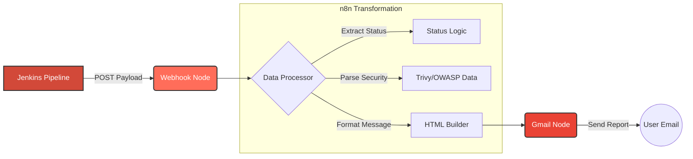

# 🚀 Gig Router Project: n8n Automation Workflows


## 📖 Overview

This directory contains the **n8n automation workflows** for the **Gig Router DevOps Project**. 

The primary workflow currently implemented is a **Smart Build Notification System**. It acts as a bridge between our CI/CD pipelines (Jenkins) and the engineering team, providing rich, real-time alerts via Email about build statuses, security vulnerabilities, and code quality issues.

Instead of generic "Build Failed" emails, this workflow analyzes the failure type (Build, Security, Quality) and formats a detailed HTML report.

---

## 🛠️ Workflow: Jenkins Build Notifier

This workflow listens for webhook events from Jenkins and sends a formatted HTML email to the subscribed recipients.

### 🧠 Logic Flow



### 🧩 Node Breakdown

| Node Type | Name | Description |
|-----------|------|-------------|
| **Webhook** | `Webhook` | Listens for `POST` requests at `/webhook/jenkins-notify`. Acts as the entry point for Jenkins. |
| **Set** | `Edit Fields` | Normalizes incoming data. Calculates `failureType` (Build vs Security), handles missing fields, and formats timestamps. |
| **Gmail** | `Send a message` | Uses OAuth2 credentials to send a beautifully formatted HTML email containing build details and error highlights. |

---

## 📨 Notification Features

The workflow generates dynamic emails based on the pipeline result:

| Feature | Description |
|---------|-------------|
| **Dynamic Header** | Color-coded headers (Green for Success, Red for Failure) |
| **Failure Classification** | Distinguishes between `BUILD_FAILED` and `SECURITY_ISSUE` |
| **Security Insights** | explicitly highlights **Trivy** critical vulnerabilities and **OWASP** dependency issues |
| **Code Quality** | Includes summary of **SonarQube** issues if present |

---

## ⚙️ Setup & Configuration

### 1. Import Workflow
1. Open your n8n dashboard.
2. Go to **Workflows** > **Import**.
3. Select the `workflows` file from this directory.

### 2. Configure Credentials
You need to set up **Gmail OAuth2** credentials in n8n:
1. Create a Project in Google Cloud Console.
2. Enable the **Gmail API**.
3. Create OAuth2 credentials (Client ID & Secret).
4. Add these to n8n under `Credentials > Gmail OAuth2`.

### 3. Connect Jenkins
Add a step in your `Jenkinsfile` (or Post-Build action) to trigger the webhook:

```groovy
post {
    always {
        script {
            def payload = """
            {
                "jobName": "${env.JOB_NAME}",
                "buildNumber": "${env.BUILD_NUMBER}",
                "buildUrl": "${env.BUILD_URL}",
                "status": "${currentBuild.currentResult}",
                "trivyCritical": ${trivy_count}, 
                "owaspHigh": ${owasp_count}
            }
            """
            httpRequest url: 'https://your-n8n-instance.com/webhook/jenkins-notify', 
                        httpMode: 'POST', 
                        requestBody: payload,
                        contentType: 'APPLICATION_JSON'
        }
    }
}
```

---

## 📂 File Structure

```
n8n/
├── workflows       # The JSON export of the n8n workflow
└── README.md       # This documentation
```

---

<p align="center">
  <sub>Generated for Gig Router DevOps Project</sub>
</p>
